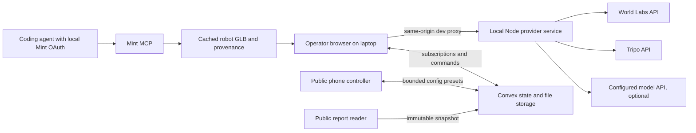

<p align="center">
  
</p>

<p align="center"><sub>
Rendered by <a href="scripts/header-animation/render.mjs"><code>scripts/header-animation</code></a> from
World Labs Marble world <code>3acfff63</code> (<code>marble-1.1</code>, text prompt): its collider mesh is
the ground truth, the 8&nbsp;mm cable is procedural. The right panel is an actual depth pass at the declared
160&times;120 raster back-projected with <code>fx&nbsp;=&nbsp;98.79&nbsp;px</code>, not an illustration &mdash; the
cable fails the sub-pixel test until 0.68&nbsp;m, inside the 1.11&nbsp;m stopping corridor. No Tripo or Mint
asset appears in this render; see <a href="#sponsor-implementation">Sponsor implementation</a>.
</sub></p>

# Blindspot

**A site photograph becomes a navigable world where we expose what a robot cannot see.**

Blindspot turns a single site photo into a generated 3D world, drives a ground robot through it under an explicitly declared sensor model, and publishes an immutable **Site Blind Spot Report** describing every failure and the assumptions that produced it.

> **Claim boundary.** Blindspot identifies *modeled* blind spots under stated simulation assumptions. It does not certify safety. A run with no detected failure is not evidence that a site is safe.

Built for the [Spatial Intelligence + Generative 3D Hackathon](https://luma.com/b101ml40) — track: **Physical AI & Simulation**.

---

## Table of contents

- [Problem statement](#problem-statement)
- [Solution](#solution)
- [How it works](#how-it-works)
- [Architecture](#architecture)
- [Sponsor implementation](#sponsor-implementation)
- [The measurement model](#the-measurement-model)
- [Design system](#design-system)
- [Repository layout](#repository-layout)
- [Getting started](#getting-started)
- [Configuration and secrets](#configuration-and-secrets)
- [Scope](#scope)
- [Verification](#verification)
- [Event](#event)
- [Documentation index](#documentation-index)
- [Known limits](#known-limits)
- [License and attribution](#license-and-attribution)

---

## Problem statement

Autonomous ground machines are commissioned on sites that nobody has modeled from the machine's point of view. The failure mode that matters is rarely a missing algorithm — it is **geometry the sensor cannot resolve in time to stop**:

- A **thin obstacle is sub-pixel at range.** An 8&nbsp;mm cable at 5&nbsp;m spans roughly 0.96 native pixels on a 640&nbsp;px raster, and about 0.24 pixels once downsampled to a 160&nbsp;px sensor target. Passive stereo has nothing to match on.
- **Late detection is not detection.** An obstacle that becomes visible inside the stopping corridor — control latency, finite braking, clearance margin — is a collision that the perception log will nonetheless record as "detected."
- **Site review today is qualitative.** A walkthrough, a photo set, and an opinion. There is no shareable artifact stating *which* hazard was missed, at *what* range, under *which* declared sensor parameters, with a denominator attached to every number.
- **Confident tooling makes it worse.** A dashboard that renders a green "safe" badge over an approximated scene converts an untested assumption into an apparent clearance.

The gap is not more perception. It is an honest, reproducible, shareable account of where a specific modeled perception stack fails on a specific site — produced *before* the machine is deployed.

---

## Solution

Blindspot is an inspection console, not a certification tool. One operator laptop renders and evaluates; phones submit bounded configurations; anyone can read the resulting report.

**1. Generate the world.** A source photograph goes to World Labs Marble, which returns a splat appearance scene (SPZ), a collider mesh, and metric scale metadata. Documented metric scale, ground-plane offset, and axis conversion are applied once, then independently verified against an aligned floor, a reference dimension, and a 1&nbsp;m ruler. Unverified scale blocks quantitative publication — it does not silently proceed in arbitrary units.

**2. Author the hazards.** A plain sentence plus the calibrated world produces three placed hazards: two exact procedural cables with specified endpoints and exact diameters, and one normalized bulk asset inside an authored, labeled collision envelope. That bulk asset was to be Tripo-generated; with no Tripo credits available it is currently an explicitly named development proxy box. Authored stress hazards are never presented as photo-confirmed infrastructure.

**3. Separate truth from perception.** Ground-truth geometry — the coarse environment collider, exact cable capsules, normalized bulk boxes — is kept strictly apart from what the sensor model can see. Splats are appearance only and never act as a depth authority. An independent opaque geometry pass renders metric depth and object IDs at the *actual* declared sensor resolution.

**4. Run the machine twice.** A **diagnostic** pass traverses the entire nominal route without reactive stopping, establishing the coverage denominator. A **reactive** pass follows the same intended route with real latency, finite braking, and swept collision, producing the actual outcome. Every metric records which pass produced it.

**5. Show the disagreement.** Two synchronized viewports share one pose, one timestamp, and one run ID: the rust cable and impact annotation on the truth side; absent or sparse stochastic points on the perception side. A two-needle dial reports hazard coverage and false-stop rate — each with a text value and a visible denominator. There is no overall safety score.

**6. Publish the artifact.** The report is an immutable snapshot: source photo, model and config versions, scale source and uncertainty, exact hazard dimensions, first-detection range, required stopping distance, failure reason, metrics with denominators, and the claim boundary above the fold and in print. It has a public read-only URL that survives reload and works with the operator laptop switched off. Later configuration or library edits cannot rewrite a published report.

---

## How it works

The geometry and sensor pipeline, in order:

1. **World.** Source photo → asynchronous Marble operation → cached SPZ, collider GLB, and metadata.
2. **Calibration.** Apply SPZ metric scale, ground-plane offset, and axis conversion once. Verify the GLB coordinate frame independently and persist separate matrices where they differ. Never double-scale an already metric GLB.
3. **Scene split.** Appearance scene = splats + visual hazards + robot body. Truth geometry = environment collider + exact cable capsules + normalized bulk boxes.
4. **Depth pass.** Render metric depth and object IDs at the declared raster (P0: an actual 160×120 target, or one bounded second preset). Derive `fx = width / (2·tan(hFov/2))` in *those* pixels.
5. **Back-projection.** Invert WebGL depth correctly with matched intrinsics. Mask floor and self; reject non-finite and near/far-invalid points.
6. **Degradation and decision.** Degraded cloud → local XZ occupancy → radius inflation (applied once) → obstacle detection in the stopping corridor → control latency plus finite braking.
7. **Collision.** Swept-volume or bounded-substep checks against **truth** geometry, so a thin span cannot tunnel between ticks. A collision counts only when detection plus braking was too late or absent.
8. **Metrics.** Coverage from the diagnostic pass; collisions, stops, and false stops from the reactive pass. Every value labeled with its source pass.

Coordinate conventions: metres, seconds, radians; X right, Y up, nominal forward −Z; route in the XZ plane; quaternions stored `[x, y, z, w]`. Collider and depth conversions carry unit tests. No physics claim depends on the decorative robot mesh.

---

## Architecture



The simulation runs **once**, on the operator laptop. Convex holds state, live subscriptions, and durable report storage; it does not render and never receives provider credentials. The local Node service owns every paid external API call and the asset cache. The public app never calls the operator's localhost. Mint is a coding-time generation workflow, not a second runtime authoring backend.

**Stack.** Vite + React + strict TypeScript; Three.js + React Three Fiber + SparkJS for rendering; Convex for state and persistence; a minimal loopback Node service for providers. No server-side 3D rendering, no Next.js, no second database, no container fleet, no custom Mint OAuth app.

**Routes.**

| Route | Purpose |
| --- | --- |
| `/` | Operator workspace. On a public deployment with authoring disabled, shows read-only session guidance — never an unauthenticated generation button. |
| `/control/:sessionId#token=…` | Lightweight phone controller. The fragment token is read once and held privately, validated server-side, and never forwarded into report URLs or analytics. |
| `/reports/:reportId` | Public immutable report. No owner or controller credentials, no engine load. |

**Module boundary.** Presentational React (`src/ui/**`) and its fixtures are entirely separate from the runtime adapter (`RuntimeRoot`, `useBlindspot`, `BlindspotViewport`), Convex integration, simulation, and provider client. Both halves are built and export against the same unchanged contract; the composition step that joins them — roughly 20–40 lines — has not been done yet. Shared types are plain serializable TypeScript with no React or Convex imports. Full behavior rules: [docs/CONTRACTS.md](docs/CONTRACTS.md); topology and Convex data model: [docs/ARCHITECTURE.md](docs/ARCHITECTURE.md).

**Concurrency and integrity.** One operator holds a short renewable lease. A queued config is claimed atomically on `session + configVersion`; runs carry a stable idempotency key. A config never mutates a running run's snapshot, and an old result can never be displayed under a newer config version — the UI shows "queued" until the matching result exists. Publishing is idempotent by run ID. An expired lease or offline operator reads "Waiting for operator," never a fabricated completion.

---

## Sponsor implementation

Four sponsor technologies, each with a distinct role. Two are delivered with real provider IDs, one is delivered with a recorded export caveat, and one did not happen — it is marked as such rather than dressed up.

| Sponsor | What it actually does here | Evidence | Honest limit |
| --- | --- | --- | --- |
| **[World Labs](https://worldlabs.ai/)** — Marble | **Delivered.** The site world: SPZ splat appearance, collider GLB, and metric scale metadata. Operation `9faf42c4-d429-4e5c-871a-427caaa2aed2`, world `6fc7e2f0-a62a-4dcf-990b-b94d9cd2e1b5`, model `marble-1.1`, cached with checksums and a recorded 324 s preparation time | `public/demo/world.json`, `public/demo/marble-job.json`, the cached `.spz` / `.glb` / `.jpg`, and `docs/evidence/b/` on `person-b` | The demo world is **text-generated** — no real venue photograph was supplied. Raw scale `1.2551026`, ground offset `0.8235686`, applied once through separately stored splat and collider matrices. The registration reference is *assumed*, so published scale stays **estimated**, never measured |
| **[Tripo](https://tripo3d.ai/)** | **Not delivered.** The intended contribution was one reusable generated bulk hazard, normalized into an authored collision envelope | The adapter, provider cache, hazard-library path, and GLB import are implemented and typechecked; no generated asset exists | The account authenticates but had **no credits** on the final live preflight (`code 2010`, "You don't have enough credit to create this task"). The engine runs an explicitly named **development proxy box**, and every report carries that limitation. The proxy is never labeled Tripo |
| **[Mint](https://mint.gg/)** | **Delivered.** The robot body: "Teal Stripe Scout Rover", asset `ks74ch8bya740cjkcz9zp55adx8dtnmn`, project "Blindspot", produced through the MCP OAuth workflow (`start_model_generation` → `wait_for_status` → `optimize_generated_model`) | `public/mint/teal-stripe-scout-rover.glb` (sha256 `85f69933…`, 856,760 bytes) and `public/mint/PROVENANCE.json` on `person-a` | The MCP artifact-download API is gated on this account tier, so the account owner exported the GLB from the Mint web viewer; the exported byte size matches the MCP-reported `original_glb`. The mesh is **decorative** — the simulated platform capsule remains the physical envelope |
| **[Convex](https://convex.dev/)** | **Delivered.** Hazard library, live phone configuration and status, versioned run results, and durable immutable reports on dev deployment `standing-pony-711` | `convex/**` with 22 passing backend tests; published reports `2befc0cd-7508-47f2-9e07-641a2bfc0478` and `4b305fa2-c750-4876-8486-3a0e35d745a1`; a report that still loads with the operator laptop offline | Convex executes no GPU simulation and stores no provider credentials — only capability hashes |
| **Founders, Inc. Events** | Presenter, venue, and community | Event attribution in this document | No Founders API integration exists or is claimed |

**Integration boundaries.** Marble, Tripo, and Mint keep separate attribution — a Mint artifact is never described as Tripo-generated unless a provider manifest establishes that provenance. Every shipped integration above carries a real task or asset ID; the one that did not happen says so in the same table. A mocked dependency never counts as a shipped integration.

**Degradation actually in effect.** The cached Marble world is used with its provenance and real preparation time rather than regenerated per demo. Tripo is absent, so the bulk hazard is a labeled development proxy and the integration is tracked incomplete. No runtime model credential was established, so scenario authoring uses the labeled deterministic preset parser and never claims live model reasoning. Calibration is verified against an assumed reference, so scale is published as estimated.

These four integrations are the team's chosen strategy. No public event rule requiring all four was found; see [docs/EVENT-SPONSORS.md](docs/EVENT-SPONSORS.md) for what is published versus assumed.

---

## The measurement model

Every headline number carries a denominator, a version, and a reproducible run.

**Sensor model.** One passive-stereo approximation, declared as such. Focal lengths and principal points are measured in pixels and change with resolution — a 640&nbsp;px-wide sensor with `fx = 600`, downsampled to 160&nbsp;px, has `fx = 150`. For a perpendicular cable, projected width ≈ `fx · diameter / axialDepth`, so threshold crossing occurs at `dCrit = fx · diameter / minPixels`. This is a stated simplification, not a universal minimum-obstacle-size law: contrast, orientation, algorithm, and active illumination all matter. We do not claim that all stereo systems fail at some universal cutoff.

**Coverage** is *tested route-hazard detection coverage* — not world surface area, and not a probability of safety.

```
coverage = detectedBeforeBoundary / eligible × 100
eligible = detectedBeforeBoundary + missedOrLate + unknown
```

Eligible encounters are defined geometrically along the fixed full diagnostic route, misses included in the denominator, and out-of-route hazards excluded with a stated reason. If `eligible` is zero **or** `unknown` is nonzero, the percentage is `null` and the report is `incomplete`. Unknowns are never dropped from the denominator to improve the number.

**False-stop rate** = `falseStopEvents / stopEvents × 100`, from the reactive pass. Whether a stop was false is decided by a ground-truth stopping-corridor check saved at the braking-decision pose and pre-braking speed — not recomputed later at zero speed. With zero stop events the value is `null` and the UI reads "No stop events," not `0%`. Zero false stops is an honest, valid P0 result; no inverse tradeoff is manufactured to make the gauge move.

**Ranges.** First-detection range is remaining along-route clearance from the platform front envelope; camera axial depth is stored separately for projection. Required stopping distance is path travel for `latency + braking + margin`, with the platform radius counted exactly once. "Not seen on the tested trajectory" and "not evaluated" are distinct states, and null is always rendered as *Not evaluated*, never as zero.

**Report status precedence.** `incomplete` if calibration is unverified, unknown encounters exist, no encounters were eligible, or a required pass failed → otherwise `blind_spot_observed` if any miss, late detection, or collision exists → otherwise `no_failure_observed`. There is no fourth, greener state.

Full metric and report rules: [docs/CONTRACTS.md](docs/CONTRACTS.md). Derivations and sources: [docs/TECHNICAL-NOTES.md](docs/TECHNICAL-NOTES.md).

---

## Design system

A precise, tactile inspection console: soft warm-gray neumorphic controls framing a cinematic dark scene. The material analogy is a well-made desktop instrument — restrained depth on the controls, crisp typography on the data, and the 3D evidence leading the first viewport. No dashboard of decorative cards, no landing-page detour, no gradient blobs or animated vanity numbers.

| Token | Value |
| --- | --- |
| Canvas / surface | `#E8ECEF` |
| Raised shadow | `8px 8px 18px #C7CCD1, -8px -8px 18px #FFFFFF` |
| Inset shadow | `inset 4px 4px 9px #C7CCD1, inset -4px -4px 9px #FFFFFF` |
| Text primary / secondary | `#202A32` / `#4D5B66` |
| Focus ring | `#006B78`, 2px, 3px offset |
| Viewport / grid / labels | `#111820` / `#25333D` / `#EEF3F6` |
| Accent / blind spot | `#006B78` teal / `#A33422` rust |
| Radius | 10px controls, 18px panels, 24px viewport frame |
| Typography | Manrope interface, IBM Plex Mono measurements, tabular figures |
| Motion | 140–220ms controls, 300ms panel reveal, honors `prefers-reduced-motion` |

Raised means clickable or grouped; inset means an input, a selection, or a recessed viewport — never both on one idle surface. Surfaces also carry a fine border so high-contrast and flat display modes stay usable, and depth is never the sole indicator of interactivity.

**Layout.** At 1440×900: a 64px top bar, a 272px left rail (source photo, world status, sentence composer, three hazard rows), and a viewport shell of at least 650px holding both synchronized views in one WebGL canvas with scissor views. Below it, a playback strip and the two-needle dial. At 1024px the rail collapses to a drawer; at 390px and 360px the phone controller carries only session identity, three preset buttons, one status line, the latest completed gauge, and the report link — it never loads the 3D engine, splats, or the provider client.

**Accessibility is a requirement, not polish.** Keyboard operability with visible focus, 44px minimum touch targets, readable contrast, reduced motion, semantic form labels, and no screen-reader announcement on every simulation frame. Required UI states — no world, uploading, generating with elapsed time, cached, calibrating, ready, evaluating, publishing, published, provider unavailable, model unavailable, disconnected, WebGL unsupported, expired token, report missing — are all specified, and retries preserve input rather than inventing a progress percentage.

Full specification: [DESIGN.md](DESIGN.md).

---

## Repository layout

`main` holds the specification, the frozen contract, the validator, and this document. The application lives on the implementation branches (see [Branches](#branches)).

```
main
├── README.md                  This document
├── AGENTS.md                  Implementation guide — read first when building on this
├── CLAUDE.md                  Claude-compatible routing to AGENTS.md
├── PRODUCT.md                 Product purpose, positioning, and claim boundaries
├── DESIGN.md                  Neumorphic visual specification and tokens
├── .env.example               Blank credential template (never filled in Git)
├── shared/
│   └── contracts.ts           Frozen contract v1 — the single source of data shape
├── docs/
│   ├── BUILD-PLAN.md          Milestones, P1 admission rules, cut order
│   ├── ARCHITECTURE.md        Topology, pipeline, Convex model, network boundary
│   ├── CONTRACTS.md           Behavior, routes, actions, metric and report rules
│   ├── SETUP.md               Access requirements and local setup
│   ├── EVENT-SPONSORS.md      Verified event facts and sponsor integration plan
│   ├── TECHNICAL-NOTES.md     Verified API corrections with primary sources
│   ├── ACCEPTANCE.md          Acceptance gates and evidence rules
│   ├── DEMO.md                Two-minute script, prepared answers, submission
│   ├── roles/                 Implementation briefs per workstream
│   ├── handoffs/              Handoff templates; filled copies live on the implementation branches
│   └── media/                 Rendered README header
└── scripts/
    ├── check-plan.mjs         Dependency-free planning-kit validator
    └── header-animation/      Header renderer: scene, capture script, cached Marble world
```

Implemented paths, and the branch each is on:

| Path | Contents | Branch |
| --- | --- | --- |
| `src/ui/**`, `src/styles/**`, `src/mocks/**` | Presentational React on the frozen contract, neumorphic design system, fixture bridge and dataset | `person-a` |
| `public/mint/**` | Mint robot GLB, preview, and sanitized provenance | `person-a` |
| `src/engine/**` | Calibration, geometry, depth and occlusion, sensor model, evaluation, presets | `person-b` |
| `src/runtime/**` | `RuntimeRoot`, `useBlindspot`, lazy `BlindspotViewport`, store, Vite engine config | `person-b` |
| `convex/**` | Schema, sessions and leases, configs, runs, reports, library, access, validation | `person-b` |
| `services/provider/**` | Loopback Node provider service, provider adapters, asset cache, operator CLI | `person-b` |
| `public/demo/**` | Cached Marble world: SPZ, collider GLB, source image, job and calibration records | `person-b` |
| `src/main.tsx`, `index.html`, `e2e/**`, hosting config | Composition and release | Not started |

---

## Getting started

### Branches

`main` is the baseline and the final release branch; it does **not** contain the application. The two implementation branches were built independently from a shared bootstrap commit (`713a33d`, plus `1a62bfb`) and have **not been merged** — there is no single branch that runs the whole product today.

| Branch | Contents | State |
| --- | --- | --- |
| `main` | Specifications, frozen contract, implementation briefs, validator, README header | Baseline; carries no application code |
| `person-a` | Frontend, design system, workspace, phone controller, report UI, fixture bridge, Mint asset | Complete on fixtures, with the real Mint robot imported |
| `person-b` | Engine, runtime bridge, Convex backend, local provider service, cached Marble world | Verified against real Marble and Convex; Tripo incomplete |

Merging the two branches, composing `src/main.tsx`, hosting the app, and setting a real `VITE_PUBLIC_APP_ORIGIN` remain outstanding. Until then, controller and report share links are `null` by design and publication from the UI stays disabled.

Filled handoff records — exact commands, real results, blockers — are in `docs/handoffs/` on each implementation branch; the copies on `main` are still templates.

### Run the frontend on fixtures — no credentials needed

```bash
git clone https://github.com/psagar29/Blindspot.git
cd Blindspot && git switch person-a
npm ci
npm run dev:ui        # http://localhost:5173/ui.html
```

The floating "Fixture controls (dev preview only)" panel walks every UI state. All simulation data here is labeled fixture data.

### Run the engine, provider service, and backend

Requires the operator's own `.env.local` (see [Configuration and secrets](#configuration-and-secrets)).

```bash
git switch person-b
npm ci
npm --prefix services/provider ci
npm --prefix services/provider run cache:restore   # verifies the cached world, zero paid calls
npm --prefix services/provider run preflight       # prints access/credit booleans only
npm --prefix services/provider run dev
```

In a second terminal, then open `http://localhost:5173/engine.html` — use that exact hostname, because the local provider validates the origin:

```bash
VITE_AUTHORING_ENABLED=true VITE_CONVEX_URL=<your .convex.cloud URL> \
  ./node_modules/.bin/vite --mode engine --config src/runtime/vite.config.ts
```

`services/provider/` keeps its own package and lockfile, so the two dependency sets never collide. `cache:restore` reuses the completed Marble job rather than generating a new world. Fresh generation is a deliberate, budgeted operator action (`cache:demo -- --generate`), not something a checkout does on its own.

### Verify a published report with no credentials at all

```bash
npm --prefix services/provider run verify:report -- \
  2befc0cd-7508-47f2-9e07-641a2bfc0478 \
  9d91af1f106f9c028c05fbec2262c24f892f2445d61bb3b15694184d1465e6b2
```

### Check the planning kit on `main`

```bash
node scripts/check-plan.mjs
```

This validates planning structure — required files, relative links, contract symbols, and a blank credentials template. It does not test physics or application behavior.

---

## Configuration and secrets

Copy `.env.example` to `.env.local` and fill it privately. **No credentials are stored in this repository**, and local credentials do not travel with a clone — every machine must be provisioned separately.

```bash
cp .env.example .env.local
chmod 600 .env.local
```

| Variable | Consumer | Nature |
| --- | --- | --- |
| `WORLD_LABS_API_KEY`, `TRIPO_API_KEY` | Local Node provider service only | Secret — never bundled, never uploaded |
| `MODEL_API_KEY`, `MODEL_BASE_URL`, `MODEL_ID` | Local provider service, optional authoring | Secret / local |
| `CONVEX_DEPLOY_KEY` | CLI only | Secret — never imported in application code |
| `VITE_CONVEX_URL` | Browser | Public configuration; the `.convex.cloud` URL |
| `VITE_PUBLIC_APP_ORIGIN` | Browser | Public — deployed HTTPS origin for QR and report links |
| `VITE_AUTHORING_ENABLED` | Browser | Public — `false` on the public controller/report deployment |
| `PROVIDER_PORT` | Local provider service | Local, default `8788` |

**The credential boundary is binding.** Provider keys remain in a local Node process on the operator's laptop, which listens on loopback and is proxied through Vite at `/api/local/*` with Origin and Host validation and a per-launch local session token. Keys do not move into Convex environment variables, cloud hosting settings, GitHub Secrets, or remote MCP configuration. Only `VITE_*` variables reach the browser bundle, and none of them is a secret. The public phone and report app never receives provider keys and cannot create provider tasks.

The React Convex client takes the **cloud** URL (`https://….convex.cloud`); `https://….convex.site` is for HTTP Actions. `VITE_PUBLIC_APP_ORIGIN` must be the deployed HTTPS origin — localhost is never a public share origin, and if the variable is unset, controller and report share links are `null` and sharing is disabled with a setup message rather than a broken URL.

**Access established so far:** World Labs (world generated and cached), Convex dev deployment `standing-pony-711`, and Mint OAuth on the generating machine. **Still outstanding:** Tripo credits, a runtime model credential if model authoring is wanted, a permitted source image with a real reference dimension, and a hosting account. The entire UI runs from fixtures with no provider keys at all. Details: [docs/SETUP.md](docs/SETUP.md).

---

## Scope

### P0 — the required vertical slice

1. A prepared Marble world with splats, an aligned collider, and measured or explicitly estimated scale with source-photo provenance.
2. A ground robot with bounded motion and finite braking on one straight or gently bent route.
3. Three hazards — two exact procedural cables with different dimensions and ranges, plus one normalized Tripo bulk asset with an explicit collision box — and a Mint-generated robot body.
4. One passive-stereo approximation: depth and proxy render, coherent intrinsics, a thin-target visibility threshold, and late detection with finite braking.
5. Truth and perception views at the same pose and timestamp — geometry drives collision, degraded points drive stop decisions.
6. A full-route diagnostic scan for coverage plus one reactive outcome run, with honest metrics.
7. Convex-backed bounded phone presets, one operator executor, versioned configs and results, and a persisted Hazard Library.
8. A public read-only report URL with an immutable snapshot, limitations, provenance, and denominators — loading with the laptop offline.
9. Chat-shaped scenario authoring from a sentence plus optional photo, using a clearly labeled deterministic preset parser when no runtime model is available.

**Where P0 actually stands.** Items 1, 2, 4, 5, 6, 7, and 9 are implemented and verified on `person-b`. Item 3 is partial: both exact cables and the real Mint robot body exist, the Tripo bulk asset does not. Item 8 is durable and credential-free to verify, but there is no hosted public origin yet, so the report URL is not yet public in the deployed sense — that waits on the release step, along with merging the two branches into one running application.

### Non-goals

Aerial flight, ToF, LiDAR, optical-flow drift, a catenary solver, model-generated adversarial placements, a second site, leaderboards, accounts, payments, a sensor budget optimizer, rigid-body dynamics, SLAM, training pipelines, VR, voxel grids, mobile 3D, and multi-user simulation execution are all out of scope. A taut procedural cable is enough.

### Cut order

Aerial → second world → texture dropout and second sensor → model-driven placement (keep labeled preset authoring) → reactive planner complexity (keep a labeled scripted diagnostic scan and observed collision check).

**Never cut:** truth/perception separation, declared scale, honest metrics, the report, local-secret handling, or the real-versus-fixture label. If reactive evaluation is dropped, collisions and false stops are marked *not evaluated* rather than invented. Full milestone table and P1 admission rules: [docs/BUILD-PLAN.md](docs/BUILD-PLAN.md).

---

## Verification

Recorded output, not checkboxes. Every figure below was actually run and written into a handoff record; nothing here is projected.

**Frontend — `person-a`, head `3058af1`** (macOS, Node 22.14.0): `npm ci` reproduces from the lockfile with 0 vulnerabilities; `npm run typecheck` passes under strict TS; `npm run test` passes **34/34** across 3 files; `npm run build:ui` produces route-level chunks — Workspace ≈ 22 kB, PhoneController ≈ 4 kB, ReportPage ≈ 10 kB, QR encoder lazily loaded at ≈ 23 kB. The 1440px workspace, 1024px collapsed rail, 390px and 360px controller (scrollWidth == 360, no overflow), print view, and report-not-found path were captured as evidence, followed by one batched fix pass and one confirmation pass.

**Engine, runtime, and backend — `person-b`, head `2712a05`** (Node 26.8.1): root/runtime **3** tests, provider/engine **17** tests, Convex backend **22** tests, all passing; both typechecks and the production `build:engine` pass. The static GPU probe reports a 2 m plane back-projection error of ≈ `3.62e-7` m and confirms floor exclusion at display pixel ratio 1.5. The lazy viewport bundle is ≈ 2.03 MB gzip including Spark; the harness entry is ≈ 87 kB gzip.

**Real runs on the cached Marble world.** Baseline: **2 of 3** diagnostic encounters detected in time — **66.7%** coverage; the 8 mm cable was first detected and braking requested at 2640 ms, collision at 2971 ms. Higher sensor resolution on identical geometry: **3 of 3**, **100%** coverage; first cable detection 2040 ms, braking 2340 ms, stop at 3340 ms, zero collisions, one near miss, zero false stops. Stop and no-stop denominators are preserved throughout, including a **null** false-stop rate on the baseline — the UI reads "No stop events," never `0%`.

**Concurrency and durability.** Two browser tabs drove controller config 4 through one operator execution with matching requested and completed versions. Sentence authoring advanced the same scenario to version 3 and completed config 5, and earlier reports kept their own snapshots. With the local provider stopped and the operator workspace closed, the public report route still loaded and the controller displayed "Waiting for operator." A value-based scan of tracked files and built browser assets found no supplied API keys and no raw owner or controller capabilities.

**Not verified.** Tripo generation and rendering — the account has no credits, so no real asset has ever been exported. The end-to-end gate is outstanding: A and B are unmerged, no composed entry exists, nothing is hosted, and `VITE_PUBLIC_APP_ORIGIN` is unset, so hosted QR and share URLs have never been exercised. Reduced motion and contrast were implemented to the tokens and spot-checked, not audited with tooling. Runtime model access was never established.

Full gates: [docs/ACCEPTANCE.md](docs/ACCEPTANCE.md). Command transcripts and evidence: `docs/evidence/a/` on `person-a`, `docs/evidence/b/` on `person-b`.

---

## Event

[Spatial Intelligence + Generative 3D Hackathon](https://luma.com/b101ml40), September 5, 2026, San Francisco, presented by Founders, Inc. Events with World Labs, Tripo, mint.gg, and Convex. Published hacking starts at 10:00 PDT and submissions close at 18:00. Track: **Physical AI & Simulation**. Team cap, prior-work eligibility, the exact rubric, and the submission form are not published — the listing assigns those rules to the onsite briefing.

**Fallback order.** Real cached run → visibly labeled recorded playback → backup video plus the existing public report. A canned result is never replayed as a fresh simulation, and online status is never fabricated.

---

## Documentation index

| Document | Contents |
| --- | --- |
| [PRODUCT.md](PRODUCT.md) | Purpose, users, positioning, capabilities, principles, claim boundaries |
| [DESIGN.md](DESIGN.md) | Neumorphic tokens, layout, components, states, report and polish pass |
| [AGENTS.md](AGENTS.md) | Implementation guide, module boundaries, hard prohibitions |
| [docs/BUILD-PLAN.md](docs/BUILD-PLAN.md) | Milestones, P1 admission rules, cut order |
| [docs/ARCHITECTURE.md](docs/ARCHITECTURE.md) | Topology, geometry pipeline, Convex model, network and credential boundary |
| [docs/CONTRACTS.md](docs/CONTRACTS.md) | Export boundary, routes, actions, local HTTP and Convex contracts, metric rules |
| [shared/contracts.ts](shared/contracts.ts) | Frozen TypeScript types — contract version 1 |
| [docs/SETUP.md](docs/SETUP.md) | Access requirements, local setup, what can finish without external access |
| [docs/EVENT-SPONSORS.md](docs/EVENT-SPONSORS.md) | Verified event facts, sponsor contributions, proof requirements |
| [docs/TECHNICAL-NOTES.md](docs/TECHNICAL-NOTES.md) | Verified API corrections and sensor math with primary sources |
| [docs/ACCEPTANCE.md](docs/ACCEPTANCE.md) | Acceptance gates, evidence rules, ready definitions |
| [docs/DEMO.md](docs/DEMO.md) | Presentation runbook, prepared answers, submission package |

---

## Known limits

Stated plainly, because the product's entire premise is that stated assumptions beat confident numbers.

- **This is not a safety certification.** Findings are conditional on declared geometry and sensor assumptions. A modeled blind spot is useful; a clean run is inconclusive.
- **The demo world is text-generated.** No real venue photograph was supplied, so the warehouse and its preview are AI-generated. A Marble reconstruction is not survey-grade evidence in any case.
- **Scale is estimated, not measured.** Raw scale `1.2551026` and ground offset `0.8235686` were applied once and inspected against floor, shelving, axes, and a 1 m ruler, but the reference dimension is *assumed*. A verified registration label never means a physical measurement.
- **Tripo never ran.** The account has no credits, so the bulk obstacle is an explicitly named development proxy box and reports carry that limitation. The proxy is not Tripo output and is never presented as such.
- **The Mint robot is decorative.** It is a real Mint asset, exported from the web viewer because MCP artifact download is gated on that account tier. The simulated platform capsule, not the mesh, is the physical envelope.
- **The two procedural cables are authored stress tests**, not observed site hazards, and the report always distinguishes authored hazards from photo-confirmed elements.
- **The sensor model is a declared approximation.** Passive stereo with a stated raster, FOV, and pixel threshold — not a validated robotics simulator, and not a claim about any specific hardware. The robot is kinematic with finite braking, not rigid-body dynamics.
- **Phone-driven results are simulations**, not hardware measurements.
- **The product is not integrated or hosted.** `person-a` and `person-b` are unmerged, there is no composed application entry, nothing is deployed, and share links stay `null` until a real `VITE_PUBLIC_APP_ORIGIN` is configured.
- **Ninety seconds was never measured.** The recorded Marble preparation for the cached world was ~324 s; the 90-second figure only ever applied to evaluating an already-cached world and remains untimed.
- **Results are client-computed** and labeled as such. Nothing here is tamper-proof, and capabilities are a narrowly scoped demo access mechanism rather than a user-account system.
- **No fabricated evidence, ever.** No invented metrics, customer logos, certification seals, green "safe" verdicts, sponsor rules, model API identifiers, or measured latencies.

---

## License and attribution

No license has been declared for this repository yet; one must be declared before submission. Generated assets carry their providers' terms — Marble worlds, Tripo models, and Mint artifacts are imported only where redistribution is permitted, each with sanitized provenance recording task ID, prompt, checksum, and source.

Blindspot is an independent hackathon project. World Labs, Tripo, mint.gg, Convex, and Founders, Inc. are named as event sponsors and as the providers of the technologies integrated here; naming them implies no endorsement of this project or its findings.

Repository: <https://github.com/psagar29/Blindspot.git>
