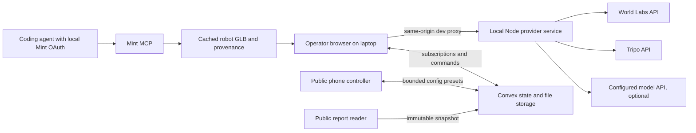

# Blindspot

**A site photograph becomes a navigable world where we expose what a robot cannot see.**

Blindspot turns a single site photo into a generated 3D world, drives a ground robot through it under an explicitly declared sensor model, and publishes an immutable **Site Blind Spot Report** describing every failure and the assumptions that produced it.

> **Claim boundary.** Blindspot identifies *modeled* blind spots under stated simulation assumptions. It does not certify safety. A run with no detected failure is not evidence that a site is safe.

Built for the [Spatial Intelligence + Generative 3D Hackathon](https://luma.com/b101ml40) — track: **Physical AI & Simulation**.

---

## Table of contents

- [Status](#status)
- [Problem statement](#problem-statement)
- [Solution](#solution)
- [How it works](#how-it-works)
- [Architecture](#architecture)
- [Sponsor implementation](#sponsor-implementation)
- [The measurement model](#the-measurement-model)
- [Design system](#design-system)
- [Repository layout](#repository-layout)
- [Getting started](#getting-started)
- [Configuration and secrets](#configuration-and-secrets)
- [Scope](#scope)
- [Verification](#verification)
- [Demo and event](#demo-and-event)
- [Documentation index](#documentation-index)
- [Known limits](#known-limits)
- [License and attribution](#license-and-attribution)

---

## Status

This repository is the **implementation plan, frozen interfaces, role instructions, and validation scripts**. The application is not built yet.

| Artifact | State |
| --- | --- |
| Product, design, and architecture specifications | Complete and frozen |
| Shared TypeScript contract (`shared/contracts.ts`) | Complete and frozen — contract version `1` |
| Role briefs, handoff templates, acceptance gates | Complete |
| Planning-kit validator (`scripts/check-plan.mjs`) | Runnable |
| Frontend, engine, provider service, Convex backend | **Not implemented** — owned by Persons A, B, and C |

Verify the kit with:

```bash
node scripts/check-plan.mjs
```

This checks planning structure — required files, relative links, contract symbols, and a blank credentials template. It does not test physics or application behavior. Application commands are deliverables of the role briefs and do not exist yet.

Where the v2 product brief and the [technical notes](docs/TECHNICAL-NOTES.md) disagree, the verified corrections in the technical notes take precedence over the brief's unsupported numerical or API claims.

---

## Problem statement

Autonomous ground machines are commissioned on sites that nobody has modeled from the machine's point of view. The failure mode that matters is rarely a missing algorithm — it is **geometry the sensor cannot resolve in time to stop**:

- A **thin obstacle is sub-pixel at range.** An 8&nbsp;mm cable at 5&nbsp;m spans roughly 0.96 native pixels on a 640&nbsp;px raster, and about 0.24 pixels once downsampled to a 160&nbsp;px sensor target. Passive stereo has nothing to match on.
- **Late detection is not detection.** An obstacle that becomes visible inside the stopping corridor — control latency, finite braking, clearance margin — is a collision that the perception log will nonetheless record as "detected."
- **Site review today is qualitative.** A walkthrough, a photo set, and an opinion. There is no shareable artifact stating *which* hazard was missed, at *what* range, under *which* declared sensor parameters, with a denominator attached to every number.
- **Confident tooling makes it worse.** A dashboard that renders a green "safe" badge over an approximated scene converts an untested assumption into an apparent clearance.

The gap is not more perception. It is an honest, reproducible, shareable account of where a specific modeled perception stack fails on a specific site — produced *before* the machine is deployed.

---

## Solution

Blindspot is an inspection console, not a certification tool. One operator laptop renders and evaluates; phones submit bounded configurations; anyone can read the resulting report.

**1. Generate the world.** A source photograph goes to World Labs Marble, which returns a splat appearance scene (SPZ), a collider mesh, and metric scale metadata. Documented metric scale, ground-plane offset, and axis conversion are applied once, then independently verified against an aligned floor, a reference dimension, and a 1&nbsp;m ruler. Unverified scale blocks quantitative publication — it does not silently proceed in arbitrary units.

**2. Author the hazards.** A plain sentence plus the calibrated world produces three placed hazards: two exact procedural cables with specified endpoints and exact diameters, and one normalized bulk asset generated by Tripo inside an authored, labeled collision envelope. Authored stress hazards are never presented as photo-confirmed infrastructure.

**3. Separate truth from perception.** Ground-truth geometry — the coarse environment collider, exact cable capsules, normalized bulk boxes — is kept strictly apart from what the sensor model can see. Splats are appearance only and never act as a depth authority. An independent opaque geometry pass renders metric depth and object IDs at the *actual* declared sensor resolution.

**4. Run the machine twice.** A **diagnostic** pass traverses the entire nominal route without reactive stopping, establishing the coverage denominator. A **reactive** pass follows the same intended route with real latency, finite braking, and swept collision, producing the actual outcome. Every metric records which pass produced it.

**5. Show the disagreement.** Two synchronized viewports share one pose, one timestamp, and one run ID: the rust cable and impact annotation on the truth side; absent or sparse stochastic points on the perception side. A two-needle dial reports hazard coverage and false-stop rate — each with a text value and a visible denominator. There is no overall safety score.

**6. Publish the artifact.** The report is an immutable snapshot: source photo, model and config versions, scale source and uncertainty, exact hazard dimensions, first-detection range, required stopping distance, failure reason, metrics with denominators, and the claim boundary above the fold and in print. It has a public read-only URL that survives reload and works with the operator laptop switched off. Later configuration or library edits cannot rewrite a published report.

---

## How it works

The geometry and sensor pipeline, in order:

1. **World.** Source photo → asynchronous Marble operation → cached SPZ, collider GLB, and metadata.
2. **Calibration.** Apply SPZ metric scale, ground-plane offset, and axis conversion once. Verify the GLB coordinate frame independently and persist separate matrices where they differ. Never double-scale an already metric GLB.
3. **Scene split.** Appearance scene = splats + visual hazards + robot body. Truth geometry = environment collider + exact cable capsules + normalized bulk boxes.
4. **Depth pass.** Render metric depth and object IDs at the declared raster (P0: an actual 160×120 target, or one bounded second preset). Derive `fx = width / (2·tan(hFov/2))` in *those* pixels.
5. **Back-projection.** Invert WebGL depth correctly with matched intrinsics. Mask floor and self; reject non-finite and near/far-invalid points.
6. **Degradation and decision.** Degraded cloud → local XZ occupancy → radius inflation (applied once) → obstacle detection in the stopping corridor → control latency plus finite braking.
7. **Collision.** Swept-volume or bounded-substep checks against **truth** geometry, so a thin span cannot tunnel between ticks. A collision counts only when detection plus braking was too late or absent.
8. **Metrics.** Coverage from the diagnostic pass; collisions, stops, and false stops from the reactive pass. Every value labeled with its source pass.

Coordinate conventions: metres, seconds, radians; X right, Y up, nominal forward −Z; route in the XZ plane; quaternions stored `[x, y, z, w]`. Collider and depth conversions carry unit tests. No physics claim depends on the decorative robot mesh.

---

## Architecture



The simulation runs **once**, on the operator laptop. Convex holds state, live subscriptions, and durable report storage; it does not render and never receives provider credentials. The local Node service owns every paid external API call and the asset cache. The public app never calls the operator's localhost. Mint is a coding-time generation workflow, not a second runtime authoring backend.

**Stack.** Vite + React + strict TypeScript; Three.js + React Three Fiber + SparkJS for rendering; Convex for state and persistence; a minimal loopback Node service for providers. No server-side 3D rendering, no Next.js, no second database, no container fleet, no custom Mint OAuth app.

**Routes.**

| Route | Purpose |
| --- | --- |
| `/` | Operator workspace. On a public deployment with authoring disabled, shows read-only session guidance — never an unauthenticated generation button. |
| `/control/:sessionId#token=…` | Lightweight phone controller. The fragment token is read once and held privately, validated server-side, and never forwarded into report URLs or analytics. |
| `/reports/:reportId` | Public immutable report. No owner or controller credentials, no engine load. |

**Module boundary.** A owns presentational React (`src/ui/**`) and fixtures; B owns the complete runtime adapter (`RuntimeRoot`, `useBlindspot`, `BlindspotViewport`), Convex integration, simulation, and provider client; C composes them in roughly 20–40 lines. Shared types are plain serializable TypeScript with no React or Convex imports. Full behavior and ownership rules: [docs/CONTRACTS.md](docs/CONTRACTS.md); topology and Convex data model: [docs/ARCHITECTURE.md](docs/ARCHITECTURE.md).

**Concurrency and integrity.** One operator holds a short renewable lease. A queued config is claimed atomically on `session + configVersion`; runs carry a stable idempotency key. A config never mutates a running run's snapshot, and an old result can never be displayed under a newer config version — the UI shows "queued" until the matching result exists. Publishing is idempotent by run ID. An expired lease or offline operator reads "Waiting for operator," never a fabricated completion.

---

## Sponsor implementation

Four sponsor technologies, each with a distinct and visible role — no redundant world generators, and no paid calls made purely to fill a logo row.

| Sponsor | Actual contribution | Owner | Proof required | Honest limit |
| --- | --- | --- | --- | --- |
| **[World Labs](https://worldlabs.ai/)** — Marble | The site world itself: SPZ splat appearance, collider geometry, and metric scale metadata, generated from the source photograph and cached before the demo | B | World / operation ID, sanitized manifest, cached files, visible scene with an aligned collider | An API key alone does not establish credits or a successful export. Generation is asynchronous and typically takes minutes |
| **[Tripo](https://tripo3d.ai/)** | One reusable generated bulk hazard in the Hazard Library, normalized into an authored, labeled collision envelope with a separate simple collider | B | Actual task / model ID, GLB, thumbnail, authored envelope, report entry | Tripo does not certify physical dimensions or sensor reflectance. `auto_size` and PBR maps are visual features, not measurements |
| **[Mint](https://mint.gg/)** | The robot body: a GLB created through the Mint MCP workflow (OAuth, `start_model_generation`, `wait_for_status`, `get_asset_artifact_manifest`) and imported into the 3D scene with sanitized provenance | A | Mint task / handoff ID, artifact manifest, imported GLB, visible robot in the scene | Using SparkJS, Three.js, or R3F is **not** using Mint. The decorative mesh never defines the physical robot envelope |
| **[Convex](https://convex.dev/)** | Shared hazard library, live phone configuration and status, versioned run results, and the durable immutable report | B; C verifies release | A change made on a second device, a matching run version, and a report reload with the laptop offline | Convex does not execute the GPU simulation and never stores provider credentials |
| **Founders, Inc. Events** | Presenter, venue, and community | C | Correct event attribution | No invented Founders API integration |

**Integration boundaries.** Marble, Tripo, and Mint keep separate attribution — a Mint artifact is never described as Tripo-generated unless a provider manifest establishes that provenance. Every integration is accompanied by a real task or model ID, or is explicitly marked incomplete in the owner's handoff. A mocked dependency never counts as a shipped integration.

**Graceful degradation.** Provider outage → a visibly labeled cached world with its provenance and real preparation time. Missing Tripo or Mint → temporary labeled development placeholders, with that sponsor integration tracked as incomplete. Missing runtime model → deterministic preset authoring, explicitly labeled, never dressed up as live model reasoning. Missing collider or unverified scale → appearance preview allowed, metric report publication disabled.

These four integrations are the team's chosen strategy. No public event rule requiring all four was found; see [docs/EVENT-SPONSORS.md](docs/EVENT-SPONSORS.md) for what is published versus assumed.

---

## The measurement model

Every headline number carries a denominator, a version, and a reproducible run.

**Sensor model.** One passive-stereo approximation, declared as such. Focal lengths and principal points are measured in pixels and change with resolution — a 640&nbsp;px-wide sensor with `fx = 600`, downsampled to 160&nbsp;px, has `fx = 150`. For a perpendicular cable, projected width ≈ `fx · diameter / axialDepth`, so threshold crossing occurs at `dCrit = fx · diameter / minPixels`. This is a stated simplification, not a universal minimum-obstacle-size law: contrast, orientation, algorithm, and active illumination all matter. We do not claim that all stereo systems fail at some universal cutoff.

**Coverage** is *tested route-hazard detection coverage* — not world surface area, and not a probability of safety.

```
coverage = detectedBeforeBoundary / eligible × 100
eligible = detectedBeforeBoundary + missedOrLate + unknown
```

Eligible encounters are defined geometrically along the fixed full diagnostic route, misses included in the denominator, and out-of-route hazards excluded with a stated reason. If `eligible` is zero **or** `unknown` is nonzero, the percentage is `null` and the report is `incomplete`. Unknowns are never dropped from the denominator to improve the number.

**False-stop rate** = `falseStopEvents / stopEvents × 100`, from the reactive pass. Whether a stop was false is decided by a ground-truth stopping-corridor check saved at the braking-decision pose and pre-braking speed — not recomputed later at zero speed. With zero stop events the value is `null` and the UI reads "No stop events," not `0%`. Zero false stops is an honest, valid P0 result; no inverse tradeoff is manufactured to make the gauge move.

**Ranges.** First-detection range is remaining along-route clearance from the platform front envelope; camera axial depth is stored separately for projection. Required stopping distance is path travel for `latency + braking + margin`, with the platform radius counted exactly once. "Not seen on the tested trajectory" and "not evaluated" are distinct states, and null is always rendered as *Not evaluated*, never as zero.

**Report status precedence.** `incomplete` if calibration is unverified, unknown encounters exist, no encounters were eligible, or a required pass failed → otherwise `blind_spot_observed` if any miss, late detection, or collision exists → otherwise `no_failure_observed`. There is no fourth, greener state.

Full metric and report rules: [docs/CONTRACTS.md](docs/CONTRACTS.md). Derivations and sources: [docs/TECHNICAL-NOTES.md](docs/TECHNICAL-NOTES.md).

---

## Design system

A precise, tactile inspection console: soft warm-gray neumorphic controls framing a cinematic dark scene. The material analogy is a well-made desktop instrument — restrained depth on the controls, crisp typography on the data, and the 3D evidence leading the first viewport. No dashboard of decorative cards, no landing-page detour, no gradient blobs or animated vanity numbers.

| Token | Value |
| --- | --- |
| Canvas / surface | `#E8ECEF` |
| Raised shadow | `8px 8px 18px #C7CCD1, -8px -8px 18px #FFFFFF` |
| Inset shadow | `inset 4px 4px 9px #C7CCD1, inset -4px -4px 9px #FFFFFF` |
| Text primary / secondary | `#202A32` / `#4D5B66` |
| Focus ring | `#006B78`, 2px, 3px offset |
| Viewport / grid / labels | `#111820` / `#25333D` / `#EEF3F6` |
| Accent / blind spot | `#006B78` teal / `#A33422` rust |
| Radius | 10px controls, 18px panels, 24px viewport frame |
| Typography | Manrope interface, IBM Plex Mono measurements, tabular figures |
| Motion | 140–220ms controls, 300ms panel reveal, honors `prefers-reduced-motion` |

Raised means clickable or grouped; inset means an input, a selection, or a recessed viewport — never both on one idle surface. Surfaces also carry a fine border so high-contrast and flat display modes stay usable, and depth is never the sole indicator of interactivity.

**Layout.** At 1440×900: a 64px top bar, a 272px left rail (source photo, world status, sentence composer, three hazard rows), and a viewport shell of at least 650px holding both synchronized views in one WebGL canvas with scissor views. Below it, a playback strip and the two-needle dial. At 1024px the rail collapses to a drawer; at 390px and 360px the phone controller carries only session identity, three preset buttons, one status line, the latest completed gauge, and the report link — it never loads the 3D engine, splats, or the provider client.

**Accessibility is a requirement, not polish.** Keyboard operability with visible focus, 44px minimum touch targets, readable contrast, reduced motion, semantic form labels, and no screen-reader announcement on every simulation frame. Required UI states — no world, uploading, generating with elapsed time, cached, calibrating, ready, evaluating, publishing, published, provider unavailable, model unavailable, disconnected, WebGL unsupported, expired token, report missing — are all specified, and retries preserve input rather than inventing a progress percentage.

Full specification: [DESIGN.md](DESIGN.md).

---

## Repository layout

```
.
├── README.md                  This document
├── AGENTS.md                  Role execution guide — read first when implementing
├── CLAUDE.md                  Claude-compatible routing to AGENTS.md
├── PRODUCT.md                 Product purpose, positioning, and claim boundaries
├── DESIGN.md                  Neumorphic visual specification and tokens
├── .env.example               Blank credential template (never filled in Git)
├── shared/
│   └── contracts.ts           Frozen contract v1 — the single source of data shape
├── docs/
│   ├── BUILD-PLAN.md          Ownership, milestones, cut order, merge discipline
│   ├── ARCHITECTURE.md        Topology, pipeline, Convex model, network boundary
│   ├── CONTRACTS.md           Behavior, routes, actions, metric and report rules
│   ├── SETUP.md               Access requirements and per-role setup
│   ├── EVENT-SPONSORS.md      Verified event facts and sponsor integration plan
│   ├── TECHNICAL-NOTES.md     Verified API corrections with primary sources
│   ├── ACCEPTANCE.md          Per-role acceptance gates and evidence rules
│   ├── DEMO.md                Two-minute script, prepared answers, submission
│   ├── roles/                 Complete briefs for Persons A, B, and C
│   └── handoffs/              Handoff templates — each owner updates only their own
└── scripts/
    └── check-plan.mjs         Dependency-free planning-kit validator
```

Implementation paths reserved by the build plan: `src/ui/**`, `src/styles/**`, `src/mocks/**`, `public/mint/**` (A); `src/engine/**`, `src/runtime/**`, `src/data/**`, `convex/**`, `services/provider/**`, `public/demo/**` (B); `src/main.tsx`, `index.html`, `e2e/**`, hosting config (C).

---

## Getting started

### Clone

```bash
git clone https://github.com/psagar29/Blindspot.git
cd Blindspot
node scripts/check-plan.mjs
```

### Start with your role

Give your coding agent this repository URL and one sentence:

| Person | Paste this | Branch | Responsibility |
| --- | --- | --- | --- |
| **A** | `I am Person A. Read AGENTS.md and complete my role end to end.` | `person-a` | Frontend, neumorphic design system, UI states, phone controller, report UI, Mint robot asset |
| **B** | `I am Person B. Read AGENTS.md and complete my role end to end.` | `person-b` | Simulation, rendering, Marble/Tripo integration, local provider service, Convex, runtime adapter |
| **C** | `I am Person C. Read AGENTS.md and complete my role end to end.` | local `person-c` only | Merge A and B, compose the app entry, verification, hosting, demo and submission |

Complete briefs: [Person A](docs/roles/PERSON-A.md) · [Person B](docs/roles/PERSON-B.md) · [Person C](docs/roles/PERSON-C.md). Agent routing instructions are in [AGENTS.md](AGENTS.md) and [CLAUDE.md](CLAUDE.md).

An agent needs actual terminal and repository access — a URL alone cannot confer it, and a Git clone never transfers local secrets or authenticated accounts.

### Branch and merge discipline

`main`, `person-a`, and `person-b` are published and begin from the same planning commit. **No Person C branch is pushed to GitHub**; C creates `person-c` locally when integrating. **Main is the common baseline and the final release branch.**

A and B implement independently and push only their own branch. C merges A first, then B, into the local integration branch, and promotes the tested result to main only when instructed by the repository owner. Nobody pushes another person's feature work to main. Integration uses ordinary merges — never force resets. If a conflict sits inside an owned feature, it goes back to that feature's owner rather than being implemented by the integrator.

A's early `A0` commit supplies the shared frontend dependency baseline and the root lockfile; B merges that commit to run the root harness without taking over A's files. B keeps a separate package and lockfile in `services/provider/` so the two never collide.

---

## Configuration and secrets

Copy `.env.example` to `.env.local` and fill it privately. **No credentials are stored in this repository**, and local credentials do not travel with a clone — every machine must be provisioned separately.

```bash
cp .env.example .env.local
chmod 600 .env.local
```

| Variable | Consumer | Nature |
| --- | --- | --- |
| `WORLD_LABS_API_KEY`, `TRIPO_API_KEY` | Local Node provider service only | Secret — never bundled, never uploaded |
| `MODEL_API_KEY`, `MODEL_BASE_URL`, `MODEL_ID` | Local provider service, optional authoring | Secret / local |
| `CONVEX_DEPLOY_KEY` | CLI only | Secret — never imported in application code |
| `VITE_CONVEX_URL` | Browser | Public configuration; the `.convex.cloud` URL |
| `VITE_PUBLIC_APP_ORIGIN` | Browser | Public — deployed HTTPS origin for QR and report links |
| `VITE_AUTHORING_ENABLED` | Browser | Public — `false` on the public controller/report deployment |
| `PROVIDER_PORT` | Local provider service | Local, default `8788` |

**The credential boundary is binding.** Provider keys remain in a local Node process on the operator's laptop, which listens on loopback and is proxied through Vite at `/api/local/*` with Origin and Host validation and a per-launch local session token. Keys do not move into Convex environment variables, cloud hosting settings, GitHub Secrets, or remote MCP configuration. Only `VITE_*` variables reach the browser bundle, and none of them is a secret. The public phone and report app never receives provider keys and cannot create provider tasks.

The React Convex client takes the **cloud** URL (`https://….convex.cloud`); `https://….convex.site` is for HTTP Actions. `VITE_PUBLIC_APP_ORIGIN` must be the deployed HTTPS origin — localhost is never a public share origin, and if the variable is unset, controller and report share links are `null` and sharing is disabled with a setup message rather than a broken URL.

**Access still required beyond the repository:** Mint OAuth on A's machine, runtime model API access if model authoring is wanted, a permitted source image with a reference dimension, and hosting account access for C. A can complete the entire UI from fixtures with no provider keys at all. Details: [docs/SETUP.md](docs/SETUP.md).

---

## Scope

### P0 — the required vertical slice

1. A prepared Marble world with splats, an aligned collider, and measured or explicitly estimated scale with source-photo provenance.
2. A ground robot with bounded motion and finite braking on one straight or gently bent route.
3. Three hazards — two exact procedural cables with different dimensions and ranges, plus one normalized Tripo bulk asset with an explicit collision box — and a Mint-generated robot body.
4. One passive-stereo approximation: depth and proxy render, coherent intrinsics, a thin-target visibility threshold, and late detection with finite braking.
5. Truth and perception views at the same pose and timestamp — geometry drives collision, degraded points drive stop decisions.
6. A full-route diagnostic scan for coverage plus one reactive outcome run, with honest metrics.
7. Convex-backed bounded phone presets, one operator executor, versioned configs and results, and a persisted Hazard Library.
8. A public read-only report URL with an immutable snapshot, limitations, provenance, and denominators — loading with the laptop offline.
9. Chat-shaped scenario authoring from a sentence plus optional photo, using a clearly labeled deterministic preset parser when no runtime model is available.

### Non-goals

Aerial flight, ToF, LiDAR, optical-flow drift, a catenary solver, model-generated adversarial placements, a second site, leaderboards, accounts, payments, a sensor budget optimizer, rigid-body dynamics, SLAM, training pipelines, VR, voxel grids, mobile 3D, and multi-user simulation execution are all out of scope. A taut procedural cable is enough.

### Cut order

Aerial → second world → texture dropout and second sensor → model-driven placement (keep labeled preset authoring) → reactive planner complexity (keep a labeled scripted diagnostic scan and observed collision check).

**Never cut:** truth/perception separation, declared scale, honest metrics, the report, local-secret handling, or the real-versus-fixture label. If reactive evaluation is dropped, collisions and false stops are marked *not evaluated* rather than invented. Full milestone table and P1 admission rules: [docs/BUILD-PLAN.md](docs/BUILD-PLAN.md).

---

## Verification

A passing planning-kit check is not proof that the application works. Acceptance is per role, and evidence is recorded output — not checkboxes ticked in advance.

**A — independent UI.** A clean checkout launches fixture mode without credentials. Neumorphic depth stays legible with shadows disabled. 1440px workspace, 1024px collapsed rail, 390px and 360px controller, and print views have no clipping or horizontal overflow. Fixture, cached, live, and recording states are unmistakable, and null metrics read *not evaluated*.

**B — correctness and backend.** Ten gates covering transforms, depth back-projection, visibility thresholds, motion and swept collision, seeded reproducibility, metric invariants, lease and idempotency concurrency, report immutability, capability enforcement, and real sponsor integration. Notably: a known planar target must back-project to the expected metres; an 8&nbsp;mm cable must be caught by swept collision without being physically thickened; and any unknown encounter must suppress the coverage percentage.

**C — one end-to-end path.** Merge, clean install, build, typecheck, and tests pass. Run from the cached world, observe at least one documented missed or late hazard, drive a preset change from a second device, publish the report, then stop the local provider and operator tab and confirm the report still loads. Confirm all four sponsor evidence records, and that no provider, deploy, or owner credential appears in tracked files, built browser JS, sourcemaps, logs, report JSON, or share URLs.

**Ready definitions.** *Feature ready:* owner preview works, checks pass, handoff complete, branch pushed. *Integration ready:* A and B exports compose with no new subsystem work, assets are durable, a real ground run and report work. *Demo ready:* public report and controller verified, operator startup reproduced, backup video plays, the two-minute rehearsal fits.

Full gates: [docs/ACCEPTANCE.md](docs/ACCEPTANCE.md).

---

## Demo and event

**Event.** [Spatial Intelligence + Generative 3D Hackathon](https://luma.com/b101ml40), September 5, 2026, San Francisco, presented by Founders, Inc. Events with World Labs, Tripo, mint.gg, and Convex. Published hacking starts at 10:00 PDT, submissions close at 18:00, and demos are two minutes per team. Track: **Physical AI & Simulation**. Team cap, prior-work eligibility, the exact rubric, and the submission form are not published — the listing assigns rules to the onsite briefing, and C confirms them in the room rather than assuming them here.

**Two-minute script.** Problem statement → source photo and cached world with visible scale source → sentence authoring with three hazards and one quantitative justification → the split view, where the cable is missed or seen too late, held for three seconds → a phone preset change producing a queued then completed version with real coverage and false-stop figures → the public Site Blind Spot Report with one hazard's diameter, range, reason, and denominator → the claim boundary. Full beat-by-beat runbook and prepared judge answers: [docs/DEMO.md](docs/DEMO.md).

**Fallback order.** Real cached run → visibly labeled recorded playback → backup video plus the existing public report. A canned result is never replayed as a fresh simulation, and online status is never fabricated.

---

## Documentation index

| Document | Contents |
| --- | --- |
| [PRODUCT.md](PRODUCT.md) | Purpose, users, positioning, capabilities, principles, claim boundaries |
| [DESIGN.md](DESIGN.md) | Neumorphic tokens, layout, components, states, report and polish pass |
| [AGENTS.md](AGENTS.md) | Role execution guide, ownership boundaries, hard prohibitions |
| [docs/BUILD-PLAN.md](docs/BUILD-PLAN.md) | Work distribution, milestones, P1 admission, cut order, merge discipline |
| [docs/ARCHITECTURE.md](docs/ARCHITECTURE.md) | Topology, geometry pipeline, Convex model, network and credential boundary |
| [docs/CONTRACTS.md](docs/CONTRACTS.md) | Export boundary, routes, actions, local HTTP and Convex contracts, metric rules |
| [shared/contracts.ts](shared/contracts.ts) | Frozen TypeScript types — contract version 1 |
| [docs/SETUP.md](docs/SETUP.md) | Access requirements, per-role setup, what can finish without external access |
| [docs/EVENT-SPONSORS.md](docs/EVENT-SPONSORS.md) | Verified event facts, sponsor contributions, proof requirements |
| [docs/TECHNICAL-NOTES.md](docs/TECHNICAL-NOTES.md) | Verified API corrections and sensor math with primary sources |
| [docs/ACCEPTANCE.md](docs/ACCEPTANCE.md) | Per-role acceptance gates, evidence rules, ready definitions |
| [docs/DEMO.md](docs/DEMO.md) | Demo script, prepared answers, submission package |

---

## Known limits

Stated plainly, because the product's entire premise is that stated assumptions beat confident numbers.

- **This is not a safety certification.** Findings are conditional on declared geometry and sensor assumptions. A modeled blind spot is useful; a clean run is inconclusive.
- **Generated scene geometry is approximate.** A Marble reconstruction is not survey-grade evidence, and a standard-size door is an estimate unless measured. Scale uncertainty is published with every report.
- **The sensor model is a declared approximation.** Passive stereo with a stated raster, FOV, and pixel threshold — not a validated robotics simulator, and not a claim about any specific hardware.
- **The robot is kinematic with braking.** Not rigid-body dynamics.
- **Ninety seconds is a target, not a measurement.** Fresh Marble generation is asynchronous and typically takes minutes; the 90-second figure applies to evaluating a *cached* world and remains unmeasured until timed.
- **Authored hazards are stress tests.** The report distinguishes photo-confirmed elements from authored hazards, always.
- **Results are client-computed** and labeled as such. Nothing here is tamper-proof, and capabilities are a narrowly scoped demo access mechanism rather than a user-account system.
- **No fabricated evidence, ever.** No invented metrics, customer logos, certification seals, green "safe" verdicts, sponsor rules, model API identifiers, or measured latencies.

---

## License and attribution

No license has been declared for this repository yet; C sets one before submission. Generated assets carry their providers' terms — Marble worlds, Tripo models, and Mint artifacts are imported only where redistribution is permitted, each with sanitized provenance recording task ID, prompt, checksum, and source.

Blindspot is an independent hackathon project. World Labs, Tripo, mint.gg, Convex, and Founders, Inc. are named as event sponsors and as the providers of the technologies integrated here; naming them implies no endorsement of this project or its findings.

Repository: <https://github.com/psagar29/Blindspot.git>
