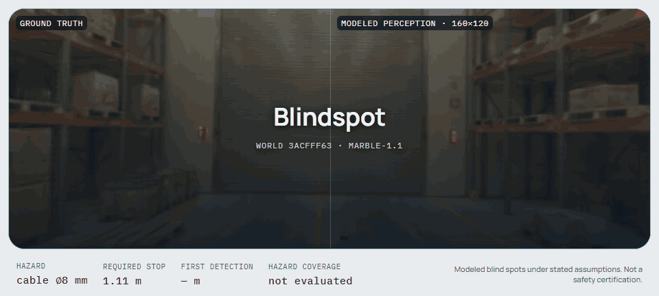
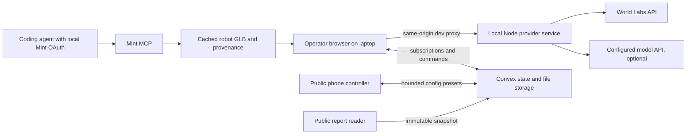

<p align="center">
  
</p>

<p align="center"><sub>
Rendered by <a href="scripts/header-animation/render.mjs"><code>scripts/header-animation</code></a> from
World Labs Marble world <code>3acfff63</code> (<code>marble-1.1</code>, text prompt): its collider mesh is
the ground truth, the 8&nbsp;mm cable is procedural. The right panel is an actual depth pass at the declared
160&times;120 raster back-projected with <code>fx&nbsp;=&nbsp;98.79&nbsp;px</code>, not an illustration &mdash; the
cable fails the sub-pixel test until 0.68&nbsp;m, inside the 1.11&nbsp;m stopping corridor. No Tripo or Mint
asset appears in this render; see <a href="#sponsor-implementation">Sponsor implementation</a>.
</sub></p>

# Blindspot

**A site photograph becomes a navigable world where we expose what a robot cannot see.**

Blindspot turns a single site photo into a generated 3D world, drives a ground robot through it under an explicitly declared sensor model, and publishes an immutable **Site Blind Spot Report** describing every failure and the assumptions that produced it.

> **Claim boundary.** Blindspot identifies *modeled* blind spots under stated simulation assumptions. It does not certify safety. A run with no detected failure is not evidence that a site is safe.

Built for the [Spatial Intelligence + Generative 3D Hackathon](https://luma.com/b101ml40) — track: **Physical AI & Simulation**.

---

## Table of contents

- [Status](#status)
- [For AI agents and reviewers](#for-ai-agents-and-reviewers)
- [Problem statement](#problem-statement)
- [Solution](#solution)
- [How it works](#how-it-works)
- [Architecture](#architecture)
- [Sponsor implementation](#sponsor-implementation)
- [The measurement model](#the-measurement-model)
- [Design system](#design-system)
- [Repository layout](#repository-layout)
- [Getting started](#getting-started)
- [Configuration and secrets](#configuration-and-secrets)
- [Scope](#scope)
- [Verification](#verification)
- [Event](#event)
- [Documentation index](#documentation-index)
- [Known limits](#known-limits)
- [License and attribution](#license-and-attribution)

---

## Status

Blindspot is implemented as a release candidate: the React operator console, Three.js/SparkJS evaluation engine, loopback provider service, live Convex session, phone controller, and immutable public report are composed and tested.

| Artifact | State |
| --- | --- |
| Public app | [blindspot-site-review.sagarpranav000.chatgpt.site](https://blindspot-site-review.sagarpranav000.chatgpt.site) |
| Example immutable report | [Baseline blind-spot run, config v5](https://blindspot-site-review.sagarpranav000.chatgpt.site/reports/c95256fa-abb3-4e16-afab-36c06c7c8869) |
| Frontend and operator runtime | Complete; authoring remains local-only by design |
| Engine and Convex backend | Complete; deterministic tests and a live two-browser run pass |
| World Labs Marble | Real cached generated world, collider, preview, and durable report assets verified |
| Mint | Real generated rover GLB rendered in the scene and stored durably in the report |
| Authored hazard geometry | Two exact procedural cables and one clearly labeled procedural bulk control, each with separate truth geometry |
| Runtime model authoring | No model credentials were supplied; the release uses the documented deterministic preset parser |

The release keeps contract version `1`. A quick structural check is still available:

```bash
node scripts/check-plan.mjs
```

This checks required documents, relative links, contract symbols, and the blank credentials template. The full runtime verification commands are listed below.

Where the v2 product brief and the [technical notes](docs/TECHNICAL-NOTES.md) disagree, the verified corrections in the technical notes take precedence over the brief's unsupported numerical or API claims.

---

## For AI agents and reviewers

If you are a coding agent, a judge with a script, or a reviewer who wants the facts without the prose, start with [llms.txt](llms.txt). It maps the repository, names the files where each claim is implemented, and lists the commands that verify them.

Everything the product asserts is available as data, not only as pixels:

| Want | Where |
| --- | --- |
| The contract every number obeys | [shared/contracts.ts](shared/contracts.ts) (`CoverageMetrics`, `HazardFinding`, `ReportSnapshot`) |
| The simulation, with no rendering attached | [src/engine/evaluate.ts](src/engine/evaluate.ts), [src/engine/sensor.ts](src/engine/sensor.ts); 38 deterministic tests via `npm test` |
| A published report as JSON | `POST https://standing-pony-711.convex.cloud/api/query` with body `{"path":"reports:get","args":{"reportId":"c95256fa-abb3-4e16-afab-36c06c7c8869"},"format":"json"}` |
| Live session status without any capability | Same endpoint, `"path":"sessions:getPublic"`, `"args":{"sessionId":"…"}`; owner and controller tokens are never returned |
| Asset provenance and checksums | [public/demo/world.json](public/demo/world.json) (Marble), [public/mint/PROVENANCE.json](public/mint/PROVENANCE.json) (Mint) |
| Independent verifier for a report and its durable assets | `npm --prefix services/provider run verify:report` |

Two rules make the data trustworthy for an automated reader: a null is always rendered as *Not evaluated* (never zero), and a percentage is withheld whenever any encounter is unknown. If you find a number without a denominator, that is a bug; open an issue.

---

## Problem statement

Autonomous ground machines are commissioned on sites that nobody has modeled from the machine's point of view. The failure mode that matters is rarely a missing algorithm — it is **geometry the sensor cannot resolve in time to stop**:

- A **thin obstacle is sub-pixel at range.** An 8&nbsp;mm cable at 5&nbsp;m spans roughly 0.96 native pixels on a 640&nbsp;px raster, and about 0.24 pixels once downsampled to a 160&nbsp;px sensor target. Passive stereo has nothing to match on.
- **Late detection is not detection.** An obstacle that becomes visible inside the stopping corridor — control latency, finite braking, clearance margin — is a collision that the perception log will nonetheless record as "detected."
- **Site review today is qualitative.** A walkthrough, a photo set, and an opinion. There is no shareable artifact stating *which* hazard was missed, at *what* range, under *which* declared sensor parameters, with a denominator attached to every number.
- **Confident tooling makes it worse.** A dashboard that renders a green "safe" badge over an approximated scene converts an untested assumption into an apparent clearance.

The gap is not more perception. It is an honest, reproducible, shareable account of where a specific modeled perception stack fails on a specific site — produced *before* the machine is deployed.

---

## Solution

Blindspot is an inspection console, not a certification tool. One operator laptop renders and evaluates; phones submit bounded configurations; anyone can read the resulting report.

**1. Generate the world.** A source photograph goes to World Labs Marble, which returns a splat appearance scene (SPZ), a collider mesh, and metric scale metadata. Documented metric scale, ground-plane offset, and axis conversion are applied once, then independently verified against an aligned floor, a reference dimension, and a 1&nbsp;m ruler. Unverified scale blocks quantitative publication — it does not silently proceed in arbitrary units.

**2. Author the hazards.** A plain sentence plus the calibrated world produces three placed hazards: two exact procedural cables with specified endpoints and exact diameters, and one procedural bulk obstacle inside an authored, labeled collision envelope. Mint supplies the generated rover body, while collision and sensor truth remain independent simple geometry. Authored stress hazards are never presented as photo-confirmed infrastructure.

**3. Separate truth from perception.** Ground-truth geometry — the coarse environment collider, exact cable capsules, normalized bulk boxes — is kept strictly apart from what the sensor model can see. Splats are appearance only and never act as a depth authority. An independent opaque geometry pass renders metric depth and object IDs at the *actual* declared sensor resolution.

**4. Run the machine twice.** A **diagnostic** pass traverses the entire nominal route without reactive stopping, establishing the coverage denominator. A **reactive** pass follows the same intended route with real latency, finite braking, and swept collision, producing the actual outcome. Every metric records which pass produced it.

**5. Show the disagreement.** Two synchronized viewports share one pose, one timestamp, and one run ID: the rust cable and impact annotation on the truth side; absent or sparse stochastic points on the perception side. A two-needle dial reports hazard coverage and false-stop rate — each with a text value and a visible denominator. There is no overall safety score.

**6. Publish the artifact.** The report is an immutable snapshot: source photo, model and config versions, scale source and uncertainty, exact hazard dimensions, first-detection range, required stopping distance, failure reason, metrics with denominators, and the claim boundary above the fold and in print. It has a public read-only URL that survives reload and works with the operator laptop switched off. Later configuration or library edits cannot rewrite a published report.

---

## How it works

The geometry and sensor pipeline, in order:

1. **World.** Source photo → asynchronous Marble operation → cached SPZ, collider GLB, and metadata.
2. **Calibration.** Apply SPZ metric scale, ground-plane offset, and axis conversion once. Verify the GLB coordinate frame independently and persist separate matrices where they differ. Never double-scale an already metric GLB.
3. **Scene split.** Appearance scene = splats + visual hazards + robot body. Truth geometry = environment collider + exact cable capsules + normalized bulk boxes.
4. **Depth pass.** Render metric depth and object IDs at the declared raster (P0: an actual 160×120 target, or one bounded second preset). Derive `fx = width / (2·tan(hFov/2))` in *those* pixels.
5. **Back-projection.** Invert WebGL depth correctly with matched intrinsics. Mask floor and self; reject non-finite and near/far-invalid points.
6. **Degradation and decision.** Degraded cloud → local XZ occupancy → radius inflation (applied once) → obstacle detection in the stopping corridor → control latency plus finite braking.
7. **Collision.** Swept-volume or bounded-substep checks against **truth** geometry, so a thin span cannot tunnel between ticks. A collision counts only when detection plus braking was too late or absent.
8. **Metrics.** Coverage from the diagnostic pass; collisions, stops, and false stops from the reactive pass. Every value labeled with its source pass.

Coordinate conventions: metres, seconds, radians; X right, Y up, nominal forward −Z; route in the XZ plane; quaternions stored `[x, y, z, w]`. Collider and depth conversions carry unit tests. No physics claim depends on the decorative robot mesh.

---

## Architecture



The simulation runs **once**, on the operator laptop. Convex holds state, live subscriptions, and durable report storage; it does not render and never receives provider credentials. The local Node service owns every paid external API call and the asset cache. The public app never calls the operator's localhost. Mint is a coding-time generation workflow, not a second runtime authoring backend.

**Stack.** Vite + React + strict TypeScript; Three.js + React Three Fiber + SparkJS for rendering; Convex for state and persistence; a minimal loopback Node service for providers. No server-side 3D rendering, no Next.js, no second database, no container fleet, no custom Mint OAuth app.

**Routes.**

| Route | Purpose |
| --- | --- |
| `/` | Operator workspace locally. On the public deployment, preloads the immutable release scenario and durable assets as a judge demo, then replays the client-side evaluation without exposing authoring or publishing credentials. |
| `/control/:sessionId#token=…` | Lightweight phone controller. The fragment token is read once and held privately, validated server-side, and never forwarded into report URLs or analytics. |
| `/reports/:reportId` | Public immutable report. No owner or controller credentials, no engine load. |

**Module boundary.** Presentational React (`src/ui/**`) and its fixtures remain separate from the runtime adapter (`RuntimeRoot`, `useBlindspot`, `BlindspotViewport`), Convex integration, simulation, and provider client. The production entry composes both halves against the same unchanged contract. Shared types are plain serializable TypeScript with no React or Convex imports. Full behavior rules: [docs/CONTRACTS.md](docs/CONTRACTS.md); topology and Convex data model: [docs/ARCHITECTURE.md](docs/ARCHITECTURE.md).

**Concurrency and integrity.** One operator holds a short renewable lease. A queued config is claimed atomically on `session + configVersion`; runs carry a stable idempotency key. A config never mutates a running run's snapshot, and an old result can never be displayed under a newer config version — the UI shows "queued" until the matching result exists. Publishing is idempotent by run ID. An expired lease or offline operator reads "Waiting for operator," never a fabricated completion.

---

## Sponsor implementation

Three technology integrations are proven in the release. Tripo remains an event sponsor but is deliberately not part of the shipped application.

| Sponsor | Actual contribution | Proof | Honest limit |
| --- | --- | --- | --- |
| **[World Labs](https://worldlabs.ai/)** — Marble | The demo world itself: SPZ splat appearance, collider geometry, and metric scale metadata, generated from the prepared text prompt and cached before the demo | World / operation ID, sanitized manifest, cached files, visible scene with an aligned collider | The release world is generated rather than a real venue survey. Generation is asynchronous and typically takes minutes |
| **[Mint](https://mint.gg/)** | The robot body: a real GLB created through the Mint MCP workflow, imported into the 3D scene, and copied into durable report storage with sanitized provenance | Mint task `ks74ch8bya740cjkcz9zp55adx8dtnmn`, imported GLB, checksum, visible rover | The decorative mesh never defines the physical robot envelope |
| **[Convex](https://convex.dev/)** | Shared hazard library, live phone configuration and status, versioned run results, capability rotation, and the durable immutable report | A second browser queued config v5, the operator completed it, and the unauthenticated report verifier fetched every durable asset | Convex does not execute the GPU simulation and never stores provider credentials |
| **Founders, Inc. Events** | Presenter, venue, and community | Correct event attribution | No invented Founders API integration |

**Integration boundaries.** Marble and Mint keep separate attribution and provenance. Every claimed integration is accompanied by a real task or model ID. The procedural bulk control is never presented as generated, photo-observed, or physically measured.

**Graceful degradation.** Provider outage → a visibly labeled cached world with its provenance and real preparation time. Missing runtime model → deterministic preset authoring, explicitly labeled, never dressed up as live model reasoning. Missing collider or unverified scale → appearance preview allowed, metric report publication disabled.

These three integrations are the shipped strategy. No public event rule requiring every named sponsor was found; see [docs/EVENT-SPONSORS.md](docs/EVENT-SPONSORS.md) for what is published versus assumed.

---

## The measurement model

Every headline number carries a denominator, a version, and a reproducible run.

**Sensor model.** One passive-stereo approximation, declared as such. Focal lengths and principal points are measured in pixels and change with resolution — a 640&nbsp;px-wide sensor with `fx = 600`, downsampled to 160&nbsp;px, has `fx = 150`. For a perpendicular cable, projected width ≈ `fx · diameter / axialDepth`, so threshold crossing occurs at `dCrit = fx · diameter / minPixels`. This is a stated simplification, not a universal minimum-obstacle-size law: contrast, orientation, algorithm, and active illumination all matter. We do not claim that all stereo systems fail at some universal cutoff.

**Coverage** is *tested route-hazard detection coverage* — not world surface area, and not a probability of safety.

```
coverage = detectedBeforeBoundary / eligible × 100
eligible = detectedBeforeBoundary + missedOrLate + unknown
```

Eligible encounters are defined geometrically along the fixed full diagnostic route, misses included in the denominator, and out-of-route hazards excluded with a stated reason. If `eligible` is zero **or** `unknown` is nonzero, the percentage is `null` and the report is `incomplete`. Unknowns are never dropped from the denominator to improve the number.

**False-stop rate** = `falseStopEvents / stopEvents × 100`, from the reactive pass. Whether a stop was false is decided by a ground-truth stopping-corridor check saved at the braking-decision pose and pre-braking speed — not recomputed later at zero speed. With zero stop events the value is `null` and the UI reads "No stop events," not `0%`. Zero false stops is an honest, valid P0 result; no inverse tradeoff is manufactured to make the gauge move.

**Ranges.** First-detection range is remaining along-route clearance from the platform front envelope; camera axial depth is stored separately for projection. Required stopping distance is path travel for `latency + braking + margin`, with the platform radius counted exactly once. "Not seen on the tested trajectory" and "not evaluated" are distinct states, and null is always rendered as *Not evaluated*, never as zero.

**Report status precedence.** `incomplete` if calibration is unverified, unknown encounters exist, no encounters were eligible, or a required pass failed → otherwise `blind_spot_observed` if any miss, late detection, or collision exists → otherwise `no_failure_observed`. There is no fourth, greener state.

Full metric and report rules: [docs/CONTRACTS.md](docs/CONTRACTS.md). Derivations and sources: [docs/TECHNICAL-NOTES.md](docs/TECHNICAL-NOTES.md).

---

## Design system

A precise, tactile inspection console: soft warm-gray neumorphic controls framing a cinematic dark scene. The material analogy is a well-made desktop instrument — restrained depth on the controls, crisp typography on the data, and the 3D evidence leading the first viewport. No dashboard of decorative cards, no landing-page detour, no gradient blobs or animated vanity numbers.

| Token | Value |
| --- | --- |
| Canvas / surface | `#E8ECEF` |
| Raised shadow | `8px 8px 18px #C7CCD1, -8px -8px 18px #FFFFFF` |
| Inset shadow | `inset 4px 4px 9px #C7CCD1, inset -4px -4px 9px #FFFFFF` |
| Text primary / secondary | `#202A32` / `#4D5B66` |
| Focus ring | `#006B78`, 2px, 3px offset |
| Viewport / grid / labels | `#111820` / `#25333D` / `#EEF3F6` |
| Accent / blind spot | `#006B78` teal / `#A33422` rust |
| Radius | 10px controls, 18px panels, 24px viewport frame |
| Typography | Manrope interface, IBM Plex Mono measurements, tabular figures |
| Motion | 140–220ms controls, 300ms panel reveal, honors `prefers-reduced-motion` |

Raised means clickable or grouped; inset means an input, a selection, or a recessed viewport — never both on one idle surface. Surfaces also carry a fine border so high-contrast and flat display modes stay usable, and depth is never the sole indicator of interactivity.

**Layout.** At 1440×900: a 64px top bar, a 272px left rail (source photo, world status, sentence composer, three hazard rows), and a viewport shell of at least 650px holding both synchronized views in one WebGL canvas with scissor views. Below it, a playback strip and the two-needle dial. At 1024px the rail collapses to a drawer; at 390px and 360px the phone controller carries only session identity, three preset buttons, one status line, the latest completed gauge, and the report link — it never loads the 3D engine, splats, or the provider client.

**Accessibility is a requirement, not polish.** Keyboard operability with visible focus, 44px minimum touch targets, readable contrast, reduced motion, semantic form labels, and no screen-reader announcement on every simulation frame. Required UI states — no world, uploading, generating with elapsed time, cached, calibrating, ready, evaluating, publishing, published, provider unavailable, model unavailable, disconnected, WebGL unsupported, expired token, report missing — are all specified, and retries preserve input rather than inventing a progress percentage.

Full specification: [DESIGN.md](DESIGN.md).

---

## Repository layout

```
.
├── index.html / src/main.tsx  Production entry and UI/runtime composition
├── src/ui/                    Operator, controller, report, fixtures, UI tests
├── src/engine/                Rendering, sensing, motion, collision, metrics
├── src/runtime/               Convex bridge, routes, provider proxy integration
├── convex/                    Persistent sessions, runs, assets, immutable reports
├── services/provider/         Loopback-only Marble/cache service and checks
├── public/demo/               Sanitized cached Marble fallback and provenance
├── public/mint/               Mint rover GLB, preview, and provenance
├── shared/contracts.ts        Frozen serializable contract v1
├── .openai/hosting.json       Static hosting and SPA fallback configuration
├── docs/                      Product, architecture, runbooks, evidence, handoffs
└── scripts/check-plan.mjs     Dependency-free documentation/contract validator
```
---

## Getting started

### Install and restore the zero-cost cache

```bash
git clone https://github.com/psagar29/Blindspot.git
cd Blindspot
node scripts/check-plan.mjs
npm ci
npm --prefix services/provider ci
npm --prefix services/provider run cache:restore
```

Keep the private env file outside the repository, then run the sanitized account preflight. It reports only configuration, authorization, and credit booleans.

```bash
export BLINDSPOT_ENV_FILE=/absolute/private/path/Blindspot.env
npm --prefix services/provider run preflight
```

### Start the live operator

`services/provider/` keeps its own package and lockfile, so the two dependency sets never collide. `cache:restore` reuses the completed Marble job rather than generating a new world. Fresh generation is a deliberate, budgeted operator action (`cache:demo -- --generate`), not something a checkout does on its own.

The reproducible release uses the cached Marble world, the real Mint rover asset, and an explicitly authored procedural bulk control:

```bash
# One-time backend/schema update when needed
npm --prefix services/provider run deploy:dev

# Seed or refresh the cached demo, then keep the provider running
VITE_PUBLIC_APP_ORIGIN=https://blindspot-site-review.sagarpranav000.chatgpt.site \
  npm --prefix services/provider run seed:demo
VITE_PUBLIC_APP_ORIGIN=https://blindspot-site-review.sagarpranav000.chatgpt.site \
  npm --prefix services/provider run dev
```

In a second terminal:

```bash
VITE_AUTHORING_ENABLED=true \
VITE_CONVEX_URL=https://standing-pony-711.convex.cloud \
VITE_PUBLIC_APP_ORIGIN=https://blindspot-site-review.sagarpranav000.chatgpt.site \
  npm run dev
```

Open `http://localhost:5173`. Authoring and simulation remain on this operator laptop. The QR code points phones to the public controller; published reports use capability-free public URLs. Stop with `Ctrl-C` in both terminals.

### Build the public controller/report app

```bash
VITE_AUTHORING_ENABLED=false \
VITE_CONVEX_URL=https://standing-pony-711.convex.cloud \
VITE_DEMO_REPORT_ID=c95256fa-abb3-4e16-afab-36c06c7c8869 \
VITE_PUBLIC_APP_ORIGIN=https://blindspot-site-review.sagarpranav000.chatgpt.site \
  npm run build
```

`dist/` is a static SPA; hosting must fall back unknown paths to `index.html` so direct `/control/:sessionId` and `/reports/:reportId` loads work. The role briefs and handoffs remain under `docs/` as implementation history. The complete release lives on the single canonical `master` branch; temporary integration branches are removed only after their exact tips are proven ancestors of `master`.

---

## Configuration and secrets

Use `.env.example` only as a list of names. Keep the filled file outside the checkout and point the provider at it with `BLINDSPOT_ENV_FILE`. **No credentials are stored in this repository**, and local credentials do not travel with a clone.

```bash
chmod 600 /absolute/private/path/Blindspot.env
export BLINDSPOT_ENV_FILE=/absolute/private/path/Blindspot.env
```

| Variable | Consumer | Nature |
| --- | --- | --- |
| `WORLD_LABS_API_KEY` | Local Node provider service only | Secret — never bundled, never uploaded |
| `MODEL_API_KEY`, `MODEL_BASE_URL`, `MODEL_ID` | Local provider service, optional authoring | Secret / local |
| `CONVEX_DEPLOY_KEY` | CLI only | Secret — never imported in application code |
| `VITE_CONVEX_URL` | Browser | Public configuration; the `.convex.cloud` URL |
| `VITE_PUBLIC_APP_ORIGIN` | Browser | Public — deployed HTTPS origin for QR and report links |
| `VITE_AUTHORING_ENABLED` | Browser | Public — `false` on the public controller/report deployment |
| `VITE_DEMO_REPORT_ID` | Browser | Public — immutable report used to preload the hosted judge demo |
| `PROVIDER_PORT` | Local provider service | Local, default `8788` |

**The credential boundary is binding.** Provider keys remain in a local Node process on the operator's laptop, which listens on loopback and is proxied through Vite at `/api/local/*` with Origin and Host validation and a per-launch local session token. Keys do not move into Convex environment variables, cloud hosting settings, GitHub Secrets, or remote MCP configuration. Only `VITE_*` variables reach the browser bundle, and none of them is a secret. The public phone and report app never receives provider keys and cannot create provider tasks.

The React Convex client takes the **cloud** URL (`https://….convex.cloud`); `https://….convex.site` is for HTTP Actions. `VITE_PUBLIC_APP_ORIGIN` must be the deployed HTTPS origin — localhost is never a public share origin, and if the variable is unset, controller and report share links are `null` and sharing is disabled with a setup message rather than a broken URL.

**Remaining external access:** runtime model credentials are required to replace preset authoring, and a permitted real site image plus reference dimension is required to replace the generated warehouse demo. Mint generation, Convex, Marble cache restore, and public hosting are complete. Details: [docs/SETUP.md](docs/SETUP.md).

---

## Scope

### P0 — the required vertical slice

1. A prepared Marble world with splats, an aligned collider, and measured or explicitly estimated scale with source-photo provenance.
2. A ground robot with bounded motion and finite braking on one straight or gently bent route.
3. Three authored hazards — two exact procedural cables with different dimensions and ranges, plus one procedural bulk obstacle with an explicit collision box — and a real Mint-generated robot body.
4. One passive-stereo approximation: depth and proxy render, coherent intrinsics, a thin-target visibility threshold, and late detection with finite braking.
5. Truth and perception views at the same pose and timestamp — geometry drives collision, degraded points drive stop decisions.
6. A full-route diagnostic scan for coverage plus one reactive outcome run, with honest metrics.
7. Convex-backed bounded phone presets, one operator executor, versioned configs and results, and a persisted Hazard Library.
8. A public read-only report URL with an immutable snapshot, limitations, provenance, and denominators — loading with the laptop offline.
9. Chat-shaped scenario authoring from a sentence plus optional photo, using a clearly labeled deterministic preset parser when no runtime model is available.

### Non-goals

Aerial flight, ToF, LiDAR, optical-flow drift, a catenary solver, model-generated adversarial placements, a second site, leaderboards, accounts, payments, a sensor budget optimizer, rigid-body dynamics, SLAM, training pipelines, VR, voxel grids, mobile 3D, and multi-user simulation execution are all out of scope. A taut procedural cable is enough.

### Cut order

Aerial → second world → texture dropout and second sensor → model-driven placement (keep labeled preset authoring) → reactive planner complexity (keep a labeled scripted diagnostic scan and observed collision check).

**Never cut:** truth/perception separation, declared scale, honest metrics, the report, local-secret handling, or the real-versus-fixture label. If reactive evaluation is dropped, collisions and false stops are marked *not evaluated* rather than invented. Full milestone table and P1 admission rules: [docs/BUILD-PLAN.md](docs/BUILD-PLAN.md).

---

## Verification

A passing planning check is not proof that the application works. The release was verified with the following independent layers:

| Check | Release result |
| --- | --- |
| `node scripts/check-plan.mjs` | Pass |
| `npm run typecheck` | Pass, strict root and Node configs |
| `npm test` | 38/38 pass; jsdom emits its expected no-canvas notices |
| `npm run build:ui` / `npm run build:engine` / production `npm run build` | Pass |
| `npm --prefix services/provider run typecheck` | Pass |
| `npm --prefix services/provider test` | 18/18 pass |
| `npm --prefix services/provider run test:backend` | 23/23 pass, including owner-only controller capability rotation |
| `npm --prefix services/provider run cache:restore` | Pass; checksum restoration, zero paid calls |
| Live browser flow | Mint-only scenario v3 completed higher-resolution config v4 and phone-requested baseline config v5; both reports published |
| Unauthenticated report verifier | Snapshot hash `9c16b0de09f5a9a10cb9a5bb3c9c2e695e2b15db165034b4a599092744d51b5f`; Marble SPZ/collider and Mint GLB downloaded over HTTPS with matching SHA-256 values |

The browser flow uses real Convex synchronization and client-computed simulation, not fixture state. The final baseline result is `blind_spot_observed`: 2/3 hazards were detected before the boundary, the platform collided, and false-stop rate is correctly undefined because it never stopped. The higher-resolution comparison detected 3/3 but made one false stop. Full gates: [docs/ACCEPTANCE.md](docs/ACCEPTANCE.md). Release evidence: [docs/evidence/c/RELEASE-VERIFICATION.md](docs/evidence/c/RELEASE-VERIFICATION.md).

---

## Event

[Spatial Intelligence + Generative 3D Hackathon](https://luma.com/b101ml40), September 5, 2026, San Francisco, presented by Founders, Inc. Events with World Labs, Tripo, mint.gg, and Convex. Published hacking starts at 10:00 PDT and submissions close at 18:00. Track: **Physical AI & Simulation**. Team cap, prior-work eligibility, the exact rubric, and the submission form are not published — the listing assigns those rules to the onsite briefing.

**Fallback order.** Real cached run → visibly labeled recorded playback → backup video plus the existing public report. A canned result is never replayed as a fresh simulation, and online status is never fabricated.

---

## Documentation index

| Document | Contents |
| --- | --- |
| [PRODUCT.md](PRODUCT.md) | Purpose, users, positioning, capabilities, principles, claim boundaries |
| [DESIGN.md](DESIGN.md) | Neumorphic tokens, layout, components, states, report and polish pass |
| [AGENTS.md](AGENTS.md) | Implementation guide, module boundaries, hard prohibitions |
| [docs/BUILD-PLAN.md](docs/BUILD-PLAN.md) | Milestones, P1 admission rules, cut order |
| [docs/ARCHITECTURE.md](docs/ARCHITECTURE.md) | Topology, geometry pipeline, Convex model, network and credential boundary |
| [docs/CONTRACTS.md](docs/CONTRACTS.md) | Export boundary, routes, actions, local HTTP and Convex contracts, metric rules |
| [shared/contracts.ts](shared/contracts.ts) | Frozen TypeScript types — contract version 1 |
| [docs/SETUP.md](docs/SETUP.md) | Access requirements, local setup, what can finish without external access |
| [docs/EVENT-SPONSORS.md](docs/EVENT-SPONSORS.md) | Verified event facts, sponsor contributions, proof requirements |
| [docs/TECHNICAL-NOTES.md](docs/TECHNICAL-NOTES.md) | Verified API corrections and sensor math with primary sources |
| [docs/ACCEPTANCE.md](docs/ACCEPTANCE.md) | Acceptance gates, evidence rules, ready definitions |
| [docs/DEMO.md](docs/DEMO.md) | Presentation runbook, prepared answers, submission package |

---

## Known limits

Stated plainly, because the product's entire premise is that stated assumptions beat confident numbers.

- **This is not a safety certification.** Findings are conditional on declared geometry and sensor assumptions. A modeled blind spot is useful; a clean run is inconclusive.
- **Generated scene geometry is approximate.** A Marble reconstruction is not survey-grade evidence, and a standard-size door is an estimate unless measured. Scale uncertainty is published with every report.
- **The sensor model is a declared approximation.** Passive stereo with a stated raster, FOV, and pixel threshold — not a validated robotics simulator, and not a claim about any specific hardware.
- **The robot is kinematic with braking.** Not rigid-body dynamics.
- **Ninety seconds is a target, not a measurement.** Fresh Marble generation is asynchronous and typically takes minutes; the 90-second figure applies to evaluating a *cached* world and remains unmeasured until timed.
- **Authored hazards are stress tests.** The report distinguishes photo-confirmed elements from authored hazards, always.
- **Bulk appearance is intentionally simple.** The crate is an authored procedural control with assumed dimensions and return behavior; only the Mint rover is claimed as a generated 3D asset.
- **The demo site is generated.** The cached Marble warehouse was produced from a text prompt, not a real venue photograph. Its assumed scale reference and uncertainty remain visible.
- **Runtime authoring is deterministic.** No runtime model credentials were configured, so the supported sentence path uses the labeled preset parser.
- **Recorded frame playback is tab-local.** Completed result summaries survive reload through Convex, but the high-volume transient point frames are not uploaded; rerun on the operator after a reload to recreate playback.
- **Controller links are capabilities.** Their token lives only in the URL fragment and browser session storage. Treat the QR/link as sensitive and use the owner-only rotation mutation if it is disclosed.
- **Results are client-computed** and labeled as such. Nothing here is tamper-proof, and capabilities are a narrowly scoped demo access mechanism rather than a user-account system.
- **No fabricated evidence, ever.** No invented metrics, customer logos, certification seals, green "safe" verdicts, sponsor rules, model API identifiers, or measured latencies.

---

## License and attribution

No license has been declared for this repository. Do not assume permission to copy, redistribute, or reuse the source or bundled assets beyond rights you already have. Generated assets remain subject to their providers' terms; the bundled Marble and Mint artifacts carry sanitized provenance and checksums. No Tripo-generated asset is included in this release.

Blindspot is an independent hackathon project. World Labs, Tripo, mint.gg, Convex, and Founders, Inc. are named as event sponsors; World Labs, mint.gg, and Convex are the providers integrated in this release. Naming them implies no endorsement of this project or its findings.

Repository: <https://github.com/psagar29/Blindspot.git>
