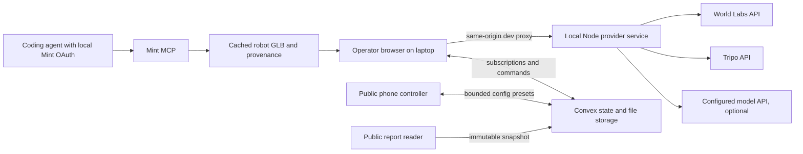

# Architecture

## Runtime topology

The simulation runs once, on the operator laptop. Convex does not render and does not store provider credentials. The local Node service owns paid external API calls and cached files. Mint is an actual coding-time generation workflow, not a second runtime authoring backend. The public app never calls the operator's localhost.

## Build boundaries

A owns presentational React and fixtures. B owns the complete `RuntimeRoot` / `useBlindspot` / `BlindspotViewport` adapter, internal routes, Convex integration, simulation, provider client and caches. C composes them. Shared types are plain serializable TypeScript without React/Convex imports.

Use Vite + React + TS, Three.js + React Three Fiber + Spark, Convex, and a minimal local Node HTTP service. No server-side 3D rendering, Next.js, Redis, second database, container fleet or custom Mint OAuth app. A pins one compatible frontend dependency set and B uses it. B's Node service has a separate package and lock to avoid lockfile conflicts.

## Geometry and sensor pipeline

1. Source photo → asynchronous Marble operation → cached SPZ + collider GLB + metadata.
2. Apply documented SPZ metric scale/ground offset/axis conversion once. Independently verify the GLB coordinate frame and scale. Persist separate matrices if necessary. Require an aligned floor, reference dimension, axes overlay and 1m ruler before metric evaluation.
3. Appearance scene: splats + visual hazards + Mint robot. Truth geometry: coarse environment collider + exact authored cable capsules + normalized bulk boxes. Coarse reconstructed geometry remains uncertain.
4. Opaque geometry pass: render metric depth and object IDs at the declared sensor resolution. Splats are not a depth authority. For P0 use actual 160×120 or a bounded second preset; derive focal length in those pixels from FOV. Ideal-candidate sampling must make raster aliasing visible rather than hiding it in the sensor model.
5. Back-project valid pixels using matched intrinsics and invert WebGL depth correctly. Mask floor/self; reject non-finite/near/far-invalid points. Apply declared passive-stereo target/texture assumptions. P0 requires thin-target approximation; texture variance is optional.
6. Degraded cloud → local XZ occupancy → radius inflation → detect obstacles in stopping corridor → latency + finite braking. Track radius inflation once; do not add it again to every distance threshold.
7. Collision checks use truth geometry with swept volume or bounded substeps. A cable may become visible closer to the robot; a collision is only a valid result if detection plus braking is too late or absent.
8. Diagnostic pass follows the full nominal route without reactive stopping to measure encounter coverage. Reactive pass follows the same intended route but stops/brakes/collides, producing actual outcome metrics. Label the pass source of each metric.

Ground physics coordinates: metres, seconds, radians; X right, Y up, nominal forward −Z (Three camera convention). Route lies in XZ. Store quaternion `[x,y,z,w]` and translation; camera extrinsics belong to the sensor mount. Collider and depth conversions have unit tests. No physics claim depends on the decorative robot mesh.

## Convex model

| Table | Minimum fields and purpose |
| --- | --- |
| `worlds` | source photo storage ID, appearance/collider asset references, separate transforms, calibration, generation provenance/status |
| `hazardLibrary` | asset reference, authored dimensions, evidence label, material assumption, source/provider task, thumbnail, version |
| `scenarios` | immutable version, world, three placed hazard instances, route, platform, seed, authoring provenance |
| `sessions` | public ID, owner capability hash, controller capability hash, lease owner/expiry, active scenario, queued config version, status |
| `configs` | session, version, bounded preset/sensor data, submitter label, created time |
| `runs` | scenario/config snapshot IDs/versions, status, seed, metrics, compact trajectory/events, schema/model versions |
| `reports` | public opaque ID, immutable ReportSnapshot, asset references, published time |

Indexes: session+configVersion; session+createdAt for runs; report publicId; library normalized request hash; world input hash. Keep full arrays small and capped. Store large blobs/assets in file storage with pointers, not table fields. Never upload point clouds on every sensor tick.

## Public functions and execution ownership

B implements an adapter so UI never depends on raw Convex ID types. Minimal API names and argument contracts, including local CLI bootstrap and subsequent owner-authorized ingestion, are in CONTRACTS.md. During local CLI bootstrap, generate a random operator capability locally, send it only to owner-authorized calls, store its hash server-side and the token privately in browser storage. A separate limited controller capability may be in the QR link; it can only request bounded presets for that session. Reports expose neither token. Capabilities are a narrowly scoped demo access mechanism, not a full user-account system.

Only one operator holds a short renewable lease. A queued config is claimed atomically using session+configVersion; the run has a stable idempotency key. Debounce controller requests and keep the newest pending version. A config never mutates a running run's snapshot. Old results may be stored but cannot replace the displayed result for a different config version. Show “queued” until its matching result is ready. Expired lease/offline operator means “Waiting for operator,” never a fabricated completion.

Runtime progress is local; persist coarse status at most around twice per second and final outputs. Use one heartbeat per operator/session, not per component render. Publishing is idempotent by run ID and creates an immutable snapshot; later config/library edits cannot rewrite it. Validate finite values, versions, bounds and owner capability on writes. Client-computed results are marked as such; do not claim tamper-proof certification.

## Credentials and network boundary

User requirement: provider keys stay local. `.env.local` is ignored and mode 0600 on the prepared machine. The local provider process loads only its named environment variables; browser bundling exposes only public variables. Do not move keys into Convex environment variables, cloud hosting settings, GitHub Secrets or remote MCP config.

Local service listens on loopback. Proxy `/api/local/*` through Vite for the operator app. Validate Origin/Host and use a per-launch local session token not committed to the repo; do not open a wildcard CORS generation API. Validate upload type/size, provider asset hostnames and cache paths; no arbitrary URL fetch or arbitrary filesystem read endpoint. Public controller actions cannot create provider tasks.

Generation is asynchronous, cancellable locally, timeout-bounded and cache-first. Persist provider operation/task ID before polling. A timeout resumes polling accepted work, never resubmits it automatically. Cache only permitted artifacts and copy public report assets to durable storage before publishing. Signed provider downloads are not permanent report URLs.

## Graceful degradation

- Provider outage: use a visibly labeled cached world/asset and display provenance and actual preparation time.
- Missing runtime model: preset authoring with deterministic reasons, explicitly labeled; do not fake model output.
- Missing Marble collider or unverified scale: allow appearance preview, disable metric report publication.
- Missing Tripo/Mint: use temporary labeled development placeholders, track sponsor integration as incomplete.
- WebGL unavailable: controller/report work; workspace gives a helpful unsupported-device state and offers the recorded run.
- Operator offline: phone queues/no new simulation; published reports remain readable.
